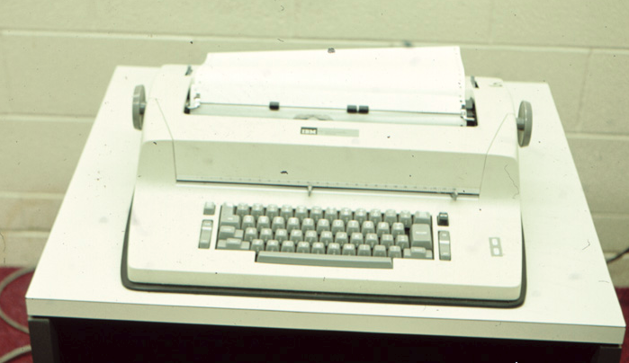
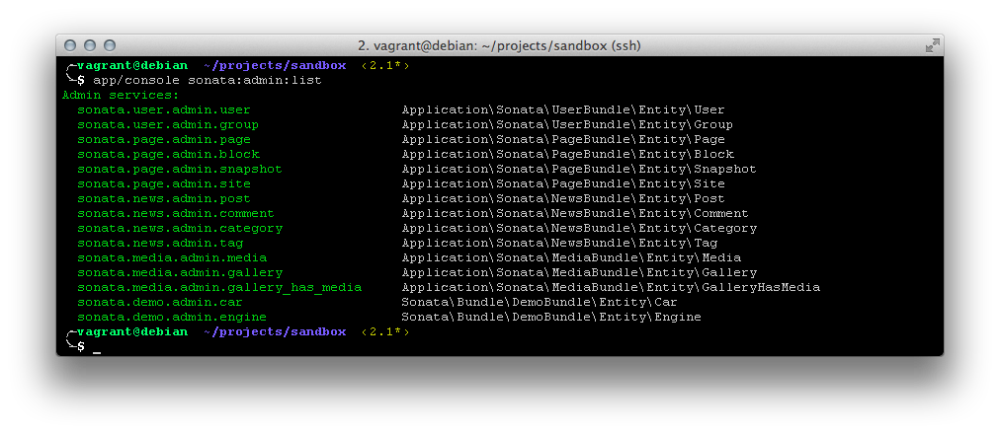

# More Basic Concepts

Hey, gentle reader! Welcome back!

This time around, I want to start introducing you to a few more basic concepts in programming using C/C++. This time, we're going to dig further into the world of functions.

# A function

In our last article, we introduced the concept of a function and how it relates to the entry point of a program. To review:

``` C++
int main()
{
    // we do work here
}
```

This represents a very special function, called the 'main entry point' and it's exactly what it sounds like. When the C++ language encounters this function, it marks it as where the program will start running from. Code can exist before this, but this really says to the program: 'hey, this is were we start!'.

From that point onward, each 'statement' is processed _in the order it appears_. So, if we were to modify that program to look like this (a modified version of the `printf` example from the last article):

``` C++
// The old tried and true example
#include <stdio.h>
int main()
{
    printf("Greetings, Program ...");
    printf("Who are you calling 'Program', Program?");

    return 0;
}
```

What will happen when the program is run (or _executed_), is that we start our _execution_ on the very first line of the body of the `main` function, which is:

``` C++
printf("Greetings, Program ...");
```

Once that statement has be run (or executed), the program will then move on to the next statement:

``` C++
printf("Who are you calling 'Program', Program?");
```

And it will print that out. If you look at the example online [here](https://repl.it/@Nuclearfossil/ProgramWithTwoLinesOfCode) you can see the results are as we expected:

``` Prompt
gcc version 4.6.3

Greetings, Program ...Who are you calling 'Program', Program?
```

... sorta

It looks like those two statements got jammed together. Shouldn't they be on separate lines? I mean, we did call two `printf` functions, right?

We sure did. But those functions are behaving correctly. What they are doing is sending those strings, verbatim, to what's called the 'console', or 'Standard Output'.

## A little history in images

Before the age of Windows and OSX and Ubuntu, there was the world of DOS and Unix.

Before that, there was the world of Mainframes.

In order for users to interact with those mainframes, they had ... limited options.

You could use punch cards to enter your programs


Then you could read the results off a printed page, or a punched output card (or a punched paper tape). That was your output device. [Great little read on working with punch card](https://en.wikipedia.org/wiki/Computer_programming_in_the_punched_card_era).

As you can imagine, that was pretty much the definition of hell. In my first year of University, I saw boxes and boxes of punched and un-punched cards lying around everywhere, as we were a 'modern' university with Mainframes and Dumb Terminals.


Or you could have used this incredibly slow teletype machine:



that worked both as an incredibly slow typewriter and output device.

See, you would type in your commands on the terminal on what was called the 'command line'. These commands would then get sent to a mainframe to be processed (out of a queue of other commands from other users) and it would then spit out the results to you on screen, under the line you had just typed. This would be done over a local network, or, more often than not, over a dedicated modem. This was hilariously slow when using the teletype machine to write any code (or do anything, for that matter). Dumb Terminals were marginally faster.

These terminals were also called 'consoles'. You may see me refer to 'typing commands on the console' - aside from showing my age, this also is fairly common when talking about using a shell of any sort. A shell, of course can also be called a 'dos prompt' or the `command shell'. On OSX or Linux, it's actually still called the console.

Typical Terminals/consoles:





Great history lesson. But what does that have to do with `printf`? Most times, when you call a function, it does exactly what you tell it to do. In the case of `printf` it prints exactly what you have between quotes. Why?

Because paper is expensive.

Hunh?

In that history lesson, remember that teletype machine I pointed out? The C language was around about the same time as those were still being used. And people were writing programs that spit output to those same teletype machines.

To save money, often times you'd concatenate data onto the same lines, from various print statements - just separating them with spaces, rather than blank lines.

So if, by default, `printf` always put output on a new line ... you'd get a lot of wasted paper.

Thus, `printf` doesn't print to a new line. If that's the case, how do we put new content onto a new line?

This is where 'escape characters' (or 'escape sequences') come into play. All escape characters start with a `\` character and are immediately followed by another character. C++ will combine these back into one special character when it generates the program to do something specific.

For example:

| Escape Character | Meaning                                                |
| ---------------- | ------------------------------------------------------ |
| \n               | Newline: Moves the output to the next line             |
| \t               | Tab: Insert 8 spaces into the output                   |
| \r               | Carriage Return: Move the output to the beginning of   |
|                  | the current line                                       |
| \"               | Double Quote: Used to inject a `"`, without            |
|                  | automatically closing the string.                      |
| \\               | Backslash: Used to inject a `\` into the string        |


So, if we want to put those two lines onto separate lines, you can do:

``` C++
    printf("Greetings, Program ...\n");
    printf("Who are you calling 'Program', Program?");
```

or

``` C++
    printf("Greetings, Program ...");
    printf("\nWho are you calling 'Program', Program?");
```

Go ahead and give that a try. Also, go ahead and try using some of the other escape sequences.

# Wrap-up

This should help you conceptualize how programs call functions to do work. In our next article, we'll discuss how one can create their own functions.

You can head back to the main article page [here](README.md) and continue on with the next article.

Until next time.

-Ash
