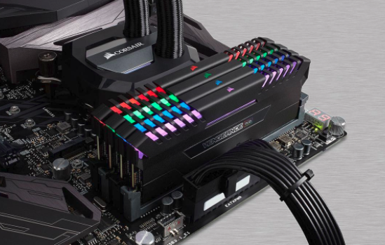

# Pointers

In this article, I want to talk a bit about a core concept in C/C++, pointers. It's incredibly important for you get get a good grasp on pointers, so I'm devoting an article just to it. As well, I expect to dedicate another article about it in ther future.

However, before we get into pointers, we have to do some book keeping ...

## Review

From the last article, I left you with a question. In the following code, there's a big bug. Were you able to find it?

``` C++
// Calculating an exponent
#include <stdio.h>

float calcPow(float base, float exponent)
{
    int iterations = exponent;
    if (exponent < 0)
    {
        iterations *= -1.0f;
    }

    float result = base;
    for (int index = 0; index < (iterations - 1); index++)
    {
        result *= base;
    }

    if (exponent < 0)
    {
        result = 1.0f / result;
    }
    return result;
}

int main()
{
    printf("5 to the power of 3 is: %f\n", calcPow(5, 3));
    printf("5 to the power of -3 is: %f\n", calcPow(5, -3));
}
```

Let me give you a hint. What happens if you were to use 0 as the exponent? Or the base? Or calculate a negative exponent?

So, if we were to replace the `main` function above with this:

``` C++
    printf("5 to the power of 0 is: %f\n", calcPow(5, 0));
    printf("0 to the power of -3 is: %f\n", calcPow(0, 3));
    printf("0 to the power of -3 is: %f\n", calcPow(0, -3));
```

Our output looks like this:

```
5 to the power of 0 is: 5.000000
0 to the power of -3 is: 0.000000
0 to the power of -3 is: inf
```

Division by zero actually is bad, mathematically (it's undefined). In C++, dividing a floating point number by a zero (floating point number) will actually return a floating point value that the compiler recognizes as infinity.

If we were to modify the program above to actually divide an integer by 0 ...

``` C++
    printf("5 to the power of 0 is: %f\n", calcPow(5, 0));
    printf("0 to the power of -3 is: %f\n", calcPow(0, 3));
    printf("0 to the power of -3 is: %f\n", calcPow(0, -3));
    printf("5 divideb by 0 is: %d\n", 5/0);
```

Doesn't actually spew out any output. Check out the link [here](http://cpp.sh/46orl).

We are given a warning about dividing by zero tho.

OK, on to the next, new thing!

## Summary

What's a pointer? Wikipedia defines it as:

> In computer science, a pointer is a programming language object, whose value refers to (or "points to") another value stored elsewhere in the computer memory using its memory address. A pointer references a location in memory, and obtaining the value stored at that location is known as dereferencing the pointer. As an analogy, a page number in a book's index could be considered a pointer to the corresponding page; dereferencing such a pointer would be done by flipping to the page with the given page number and reading the text found on the indexed page.

To clarify, what's stored in a pointer variable is a memory address. A pointer, depending on the operating system, can be of different sizes. You know how you can get a 32 or 64 bit version of windows? Yep, that is how big a pointer is (32 bits for a 32 bit OS, 64 in a 64 bit os).

  - That's an incredibly naive way to describe the difference between 32 and 64 bit operating systems. But at it's core, it's not wrong. It's just that there's a lot more going on than just that. In a later article, I'll talk more about 32 and 64 bit pointers and address spaces.

So what does a pointer actually mean? It literally is a memory address, but C/C++ knows what kind of data the pointer is addressing.

Let's jump over to the C++ shell to illustrate how pointers work (in a rudimentary fashion).

``` C++
// Example program
#include <stdio.h>

// File Global variables
int gA;             // a file global integer variable
int gB;             // a file global integer variable
int* gPointer;      // a file global integer pointer


int main()
{
  gA = 5;
  gB = 10;

  gPointer = &gA;

  printf("gA: %d\n", gA);
  printf("gB: %d\n", gB);
  printf("gPointer: %p\n", gPointer);
  printf("Value gPointer points to: %d\n", *gPointer);

  gPointer = &gB;
  printf("gPointer: %p\n", gPointer);
  printf("Value gPointer points to: %d\n", *gPointer);

  *gPointer = 15;

  printf("gA: %d\n", gA);
  printf("gB: %d\n", gB);
  printf("gPointer: %p\n", gPointer);
  printf("Value gPointer points to: %d\n", *gPointer);
}
```

The above code results in:

```
gA: 5
gB: 10
gPointer: 0x600b4c
Value gPointer points to: 5
gPointer: 0x600b48
Value gPointer points to: 10
gA: 5
gB: 15
gPointer: 0x600b48
Value gPointer points to: 15
```

[Link to example](http://cpp.sh/86otz)

That is going to need a little bit of unpacking. First off, we have three variables defined:

``` C++
// File Global variables
int gA;             // a file global integer variable
int gB;             // a file global integer variable
int* gPointer;      // a file global integer pointer
```

`gA` and `gB` are just integer variables. Why did I name them that way? Why is there a `g` in front of `A` and `B`.  This is just a convention that I have. The `g` represents a `g`lobal variable. It's only for readability for the person next reading this code; it doesn't mean a thing to the compiler. Once we get more familiar with the language, I'll talk a bit more about coding conventions.

`gPointer` is an integer variable _pointer_. This simply states that this variable will hold the address of a memory location that is an integer. That's it.

Doing something like this:

``` C++
float someVariable;
float* someVariablePointer;
```

Means that `someVariablePointer` will point to a `float` type in memory.

Confused yet? If you are, that's OK, because it can be confusing. It'll get more complex when we talk about 'dynamic memory allocation'. But we aren't going there just yet. One step at a time.

Let's go back to how we declare variables. Looking at how we declared `gA` and `gB`:

``` C++
int gA;             // a file global integer variable
int gB;             // a file global integer variable
```

Each of those two lines creates a variable in memory. That 'in memory' is kind of a broad term, as computer programs tend to have two types of memory: the 'stack' and the 'heap'. Before we get into the differen types of memory, we should really talk a little about what memory _is_.

### Theory time

We've all seen these guys, right:



That is RAM memory. RAM, of course, stands for 'Random Access Memory', which means that you can access the memory in any random fashion you like. You can read and write to it (there's also ROM - Read Only Memory, but that's traditionally used for other things, like you bios), and it's very fast. Not the fastest memory, but it's pretty dang quick.

But what _is_ memory? It's a lot of bits put together in a linear collection. A _bit_ can be on or off, 1 or 0, true of false (this is also considered a boolean value). Put 8 bits together and you have a byte.

And as far as C/C++ is concerned, a byte is the smallest unit of data you can work with, from a storage standpoint. You can work with individual bits, but it's not as simple as 'what is the value of this bit'. This is something else we'll talk about later, but for now, assume that all you are able to read/write from memory, at it's atomic level, are bytes.

Bytes can do a lot of things. A byte can hold an ASCII character (what you're looking at now is a bunch of bytes - each letter is a byte). It can also represent an unsigned number: 0 - 255. It can also represent a signed number (-128 to 127).

How does that work? Let's look at how we can store an unsigned number:

```
bit 7  6  5  4  3  2  1  0
   [0][0][0][0][0][0][0][0]
```

That's a layout of a byte, in memory (using my fantastic ASCII art skils). Now, here's the thing - using bits, we can count in binary (0 and 1), much like we can using our base 10 system.

Consider this base 10 example:

<pre>
factor of 10: 7  6  5  4  3  2  1  0
             [0][0][0][0][0][0][0][1]  = 1      = 10<sup>0</sup>
             [0][0][0][0][0][0][1][0]  = 10     = 10<sup>1</sup>
             [0][0][0][0][0][1][0][0]  = 100    = 10<sup>2</sup>
             [0][0][0][0][1][0][0][0]  = 1000   = 10<sup>3</sup>
             [0][0][0][1][0][0][0][0]  = 10000  = 10<sup>4</sup>
</pre>

This is analagous to 10<sup>x</sup>, where the value of `x` would be the position in that table of a non-zero value.

Right, but how does that work for non factor of 10 numbers? Well, the formula would look like this:

> n * 10<sup>position</sup>

For example:

<pre>
factor of 10: 7  6  5  4  3  2  1  0
             [0][0][0][0][0][0][0][5]  = 5      = 5 * 10<sup>0</sup>
             [0][0][0][0][0][0][2][0]  = 20     = 2 * 10<sup>1</sup>
             [0][0][0][0][0][8][0][0]  = 800    = 8 * 10<sup>2</sup>
             [0][0][0][0][9][0][0][0]  = 9000   = 9 * 10<sup>3</sup>

</pre>

More complex numbers is nothing but a summation of each element, using the same formula:

<pre>
factor of 10: 7  6  5  4  3  2  1  0
             [0][0][0][0][0][4][0][3]  = 403   = 0 * 10<sup>7</sup> + 0 * 10<sup>6</sup> + 0 * 10<sup>5</sup> + 0 * 10<sup>4</sup> + 0 * 10<sup>3</sup> + 4 * 10<sup>2</sup> + 0 * 10<sup>1</sup> + 2 * 10<sup>0</sup>
</pre>

Now, how does that map to a binary value? Well, it's exactly the same thing, except that we only can put a 0 or 1 as the `n` value of the earlier equation <pre>n * 10<sup>position</sup></pre>. Thus, for binary representation, we can simplify it down to: <pre>10<sup>position</sup></pre>

And can be generalized as a sum across all positions.

As an example:

<pre>
bit 7  6  5  4  3  2  1  0
   [0][0][0][1][0][1][0][1] = (0 * 2<sup>7</sup>) + (0 * 2<sup>6</sup>) + (0 * 2<sup>5</sup>) + (1 * 2<sup>4</sup>) + (0 * 2<sup>3</sup>) + (1 * 2<sup>2</sup>) + (0 * 2<sup>1</sup>) + (1 * 2<sup>0</sup>)
                            = 0 + 0 + 0 + 16 + 0 + 4 + 0 + 1
                            = 21
</pre>

That is how whole, positive numbers are stored in binary. As an exercise for the reader, I'll let you expand on this to see why a byte can hold a minimum value of 0 and a maximum value of 255.

That was for a single byte of data. But the types we are using for the variables `gA` and `gB` are `int` types. They're much bigger than a byte. But how big are they? The answer is 'It depends'. For now, assume that an `int` takes up 4 bytes worth of space in memory. Also, what if we wanted to store a negative number? How do we do that? We use a method called "two's complement". I don't want to get into those topics right now. I think I'll dedicate an article later to it (it's pretty necessary when talking about storing data to a file).

### Back to the example in C++ shell

Looking back to the code, `gA` and `gB` are created on the stack. You don't have to do anyting special to create, or allocate, the space in memory for those variables. C/C++ does that for you automatically. But they are created *on the stack*.

This means that the compiler will alocate enough room in memory to hold an integer varialbe ... *on the stack* ... automatically for you. You can also get and put data into it like we've seen already, by using the `=` operator, or just 'using' the variable, like we did with the `printf` function.

However, there are times when you want to store a pointer to a variable. Trust me, you're going to do this a _lot_ in C/C++. So if you want to create a pointer variable, you'll need to know the type, add a `*` after the type name and before the variable, like we did with `int* gPointer`.

As a side note, some coding conventions like to put the `*` symbol next to the type, some conventions like to put it next to the variable. It's totally a personal preference and if you look at some of my code samples in github, you'll see that I'm ... fluid ... in where I put the `*`. It's not uncommon to see pointers declared like:

``` C++
int* somePointer;
int *someOtherPointer;
```

It really comes down to coding style and conventions.

OK, back to the code and the output.

``` C++
int main()
{
  gA = 5;
  gB = 10;

  gPointer = &gA;
```

As you can see, we assign a value of `5` and `10` into `gA` and `gB` respectively.

On the subsequent line we now have that pointer variable getting assigned ... something. Let's answer a differe question right now: what does a pointer do? In it's simplest form, a pointer variable holds a memory address. Contrast that to what an integer variable holds; an integer value. So, if we were to have a pointer variable 'point to' the memory location of the integer variable, we need to get that memory address. That's what's happening in that line, we are using the `address of` operator to get the memory address of the variable `gA`, with the `&` operator.

Quick note: `&` is used in many, many different contexts. It's what we call 'overloaded'.

So, this line:

``` C++
  gPointer = &gA;
```

Can be read as: "The pointer variable `gPointer` is assigned the address of `gA`".

We are not storing the value _in_ `gA` to `gPointer`. We are storing the location, in memory, of where `gA` resides. That's it.


Think of that dial as the pointer - `gPointer` now points to `gA`.

In the next bit of code, we actually print out what's in the variables:

``` C++
  printf("gA: %d\n", gA);
  printf("gB: %d\n", gB);
  printf("gPointer: %p\n", gPointer);
  printf("Value gPointer points to: %d\n", *gPointer);
```

In the third `printf` statement, you'll notice a new printing formatter, the `%p`. This means "print out the memory address provided by a pointer variable". Finally, in our last line we also print out `gPointer`. Or do we? We actually access `gPointer` with an `*` in front of it.  Doesn't that mean 'multiplication'? Not in this case. As with the `&` operation, `*` is also overloaded. When used in this context, it's called a `dereferencing operation`. That's fancy talk for "actually, get me what this pointer variable it pointing to". It can be read as "dereference `gPointer`", and it has the affect of making `gPointer` look like whatever it's pointing to; in this case, it's `gB`. To confirm that, let's look at the output:

```
gA: 5
gB: 10
gPointer: 0x600b4c
Value gPointer points to: 5
```

Memory address are typically printed out in hexidecimal. That's base 16. Because we need another way to represent numbers. I'm not going into that right now, because I'm going to do an article later on numerical representation much, much later. However, base 16 means that each element in a number can have a 16 different values (0-9 plus A-F). There's also an Octal representation that only uses the values of 0-8 for each numerical element. Fun times ahead.

In the next bit of code, we do a little more with pointers:

``` C++
  gPointer = &gB;
  printf("gPointer: %p\n", gPointer);
  printf("Value gPointer points to: %d\n", *gPointer);
}
```

In the first line of the snippet above, we again store another memory address into `gPointer`. But this time it's the address of the integer variable `gB`. 


Think of it like turning the dial to point to a different location - which is exactly what we're doing! And then we print out the memory addres of where `gPointer` is pointing and it's value (via dereferencing):

```
gPointer: 0x600b48
Value gPointer points to: 10
```

We can see that the memory address is different and that what we dereference is actually a different value.

``` C++
  *gPointer = 15;

  printf("gA: %d\n", gA);
  printf("gB: %d\n", gB);
  printf("gPointer: %p\n", gPointer);
  printf("Value gPointer points to: %d\n", *gPointer);
}
```

In our last snippet of the main function, we see that we're dereferencing `gPointer` again. And assinging that result the value of `15`. Remeber, dereferencing a pointer transforms it into whatever it was the pointer referenced. In this case, that's `gB`. So we end up putting the value of `15` into `gB`.  Looking at our output confirms that:

```
gA: 5
gB: 15
gPointer: 0x600b48
Value gPointer points to: 15
```

# Wrap up

That is a very, very brief introduction to pointers. We aren't done.  I'm working on another article that digs a little deeper into this topic, but I think it's time that we actually write some code on our own computer with Visual Studio!

You can head back to the main article page [here](README.md) and continue on with the next article.

Until next time!

-Ash

# References

- What a float actually looks like: [Single-precision floating point format](https://en.wikipedia.org/wiki/Single-precision_floating-point_format)
