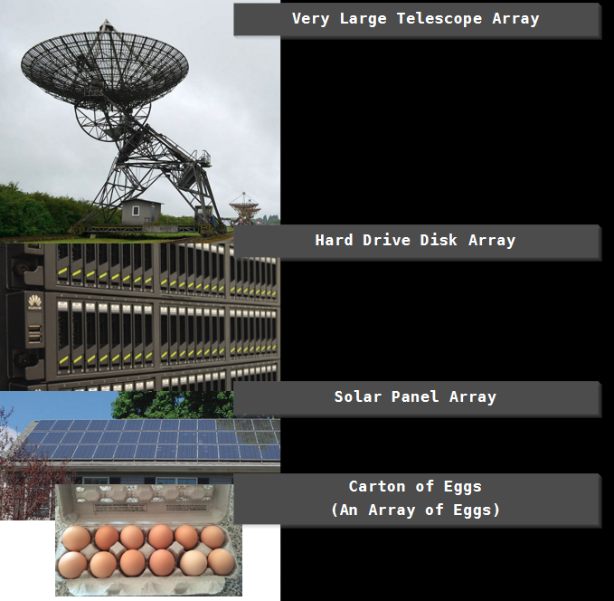

# Arrays and Graphics

## Overview

In this next article, we introduce the concept of _arrays_, their use and how they relate to memory.

At the end of this article, you should have some graphics on the screen that move. Overall, this should be a more interesting article than in the past.

## What is an array

We've all seen them. It's a collection of 'like' stuff. Wikipedia defines an array as:

> An array is a systematic arrangement of similar objects, usually in rows and columns.

## Real world examples of arrays



Arrays in programming are pretty much a unified collection of 'like' objects. You can have an array of `int`s, `float`s, `bool`s, or even your own structs. You can also have arrays of pointers too!

What does that look like in C/C++?

``` C++
#include <stdio.h>

int main() 
{
    // an integer array with 5 elements
    int values[5];

    // a float array with 10 elements;
    float temperatures[10];

    // a boolean array with 20 elements
    bool somethingElse[20];

    // an example of setting the values in each element
    values[0] = 1;
    values[1] = 2;
    values[2] = 3;
    values[3] = 4;
    values[4] = 5;

    for (int index = 0; index < 5; index++)
    {
        printf("element at index %d is %d\n", index, values[index]);
    }
}
```

This resuls in:

``` Prompt
gcc version 4.6.3
   
element at index 0 is 1
element at index 1 is 2
element at index 2 is 3
element at index 3 is 4
element at index 4 is 5
```

We've defined 3 arrays now: `values`, `temperatures` and `somethingElse`.

Breaking down the syntax of each array declaration:

| type | variable name |   | How big an array to make | | |
| ---- |:-------------:| - |:------------------------:|-|-|
| int  | values        | [ | 5 | ] | ; |
| float | temperatures | [ | 10 | ] | ; |
| bool | somethingElse | [ | 20 | ] | ; |


To review, from the code example:

- declare a variable like you would normally
- we define how lart the array is by taking the number of elements we want and wrapping it in `[` `]`
- ALL ARRAYS ARE INDEXED FROM THE 0 ELEMENT!
    - I can't stress this enough - in C++ the first element of any array is the `0` element.
- If you try to access beyond the length of the array, you _will_ get undefined behaviour.

On that last point, you can see it for yourself. Anywhere in the above code, go ahead an try to add the following code:

``` C++
printf("beyond the pale %d\n", values[5]);
```

Re-run the program and see what you get.

On my implementation, I saw the following:

``` Prompt
beyond the pale 32765
```

You may see that, or you may (most likely) see a different value. That's because we've run off the end of the array and are in ... well ... undefined space. It's entirely possible that the memory after the 5th element in the array is something else entirely.

Running off the end of an array is a common bug in programming.

## More Array Types

What we've seen so far is a 1 dimensional, or linear, array.  We can also define a 2D array. It folows a similar syntax:

`int array2D[2][6];`

You can also create a 3D array:

`int array3D[2][6][7];`

And a 4D array:

`int array4D[2][6][7][10];`

And so on ... but you won't ever do that (I hope).

What does a program that uses a 2D array look like?

``` C++
#include <stdio.h>

int main()
{
    // Set up a 5x7 rectangular grid
    int Grid[5][7];

    // Set up a 10x10 square grid
    float Weights[10][10];

    // initialize the Grid to 0
    for (int a = 0; a < 5; a++)
    {
        for (int b = 0; b < 5; b++)
        {
            Grid[a][b] = 0;
        }
    }

    // Initialize the Weights to 0.0f
    for (int a = 0; a < 10; a++)
    {
        for (int b = 0; b < 10; b++)
        {
            Weights[a][b] = 0.0f;
        }
    }

    // Set some random values
    Grid[2][2] = 9;
    Grid[4][1] = 3;
    Grid[3][4] = 1;

    Weights[0][0] = 5;
    Weights[9][7] = 2;
    Weights[4][5] = 7;
    Weights[7][7] = 3;
    Weights[2][2] = 5;
    Weights[6][4] = 1;
    Weights[0][5] = 8;

    // and draw the arrays
    printf("Grid ----------------\n");
    for (int a = 0; a < 5; a++)
    {
        for (int b = 0; b < 5; b++)
        {
            printf("[%d]",Grid[a][b]);
        }
        printf("\n");
    }

    printf("\nWeights\n");
    for (int a = 0; a < 10; a++)
    {
        for (int b = 0; b < 10; b++)
        {
            printf("[%2.2f]", Weights[a][b]);
        }
        printf("\n");
    }

}
```

And the results:

``` Prompt
gcc version 4.6.3

Grid ----------------
[0][0][0][0][0]
[0][0][0][0][0]
[0][0][9][0][0]
[0][0][0][0][1]
[0][3][0][0][0]

Weights
[5.00][0.00][0.00][0.00][0.00][8.00][0.00][0.00][0.00][0.00]
[0.00][0.00][0.00][0.00][0.00][0.00][0.00][0.00][0.00][0.00]
[0.00][0.00][5.00][0.00][0.00][0.00][0.00][0.00][0.00][0.00]
[0.00][0.00][0.00][0.00][0.00][0.00][0.00][0.00][0.00][0.00]
[0.00][0.00][0.00][0.00][0.00][7.00][0.00][0.00][0.00][0.00]
[0.00][0.00][0.00][0.00][0.00][0.00][0.00][0.00][0.00][0.00]
[0.00][0.00][0.00][0.00][1.00][0.00][0.00][0.00][0.00][0.00]
[0.00][0.00][0.00][0.00][0.00][0.00][0.00][3.00][0.00][0.00]
[0.00][0.00][0.00][0.00][0.00][0.00][0.00][0.00][0.00][0.00]
[0.00][0.00][0.00][0.00][0.00][0.00][0.00][2.00][0.00][0.00]
```

[Link to code](https://repl.it/@Nuclearfossil/MultiDimentionalArray)

# Wrap-up

That's a fair bit covered in this article. But it's a lot of good ground. In our next article, we'll talk more about graphics and animation.

Until next time!

-Ash