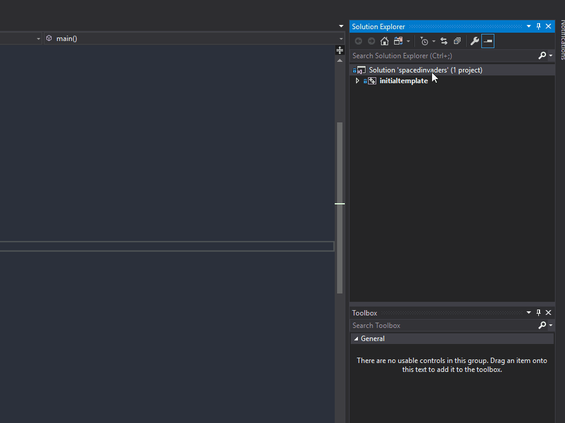
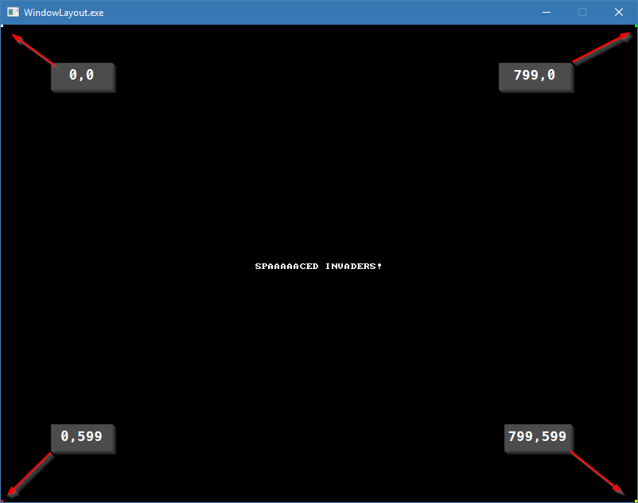
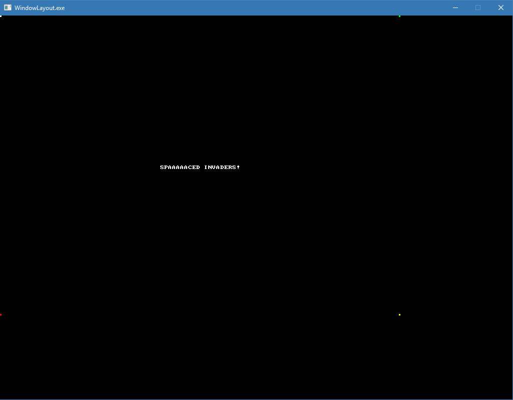

# Arrays and Graphics

## Overview

In this next article, we introduce the concept of _arrays_, their use and how they relate to memory.

At the end of this article, you should have some graphics on the screen that move. Overall, this should be a more interesting article than in the past.

## What is an array

We've all seen them. It's a collection of 'like' stuff. Wikipedia defines an array as:

> An array is a systematic arrangement of similar objects, usually in rows and columns.

## Real world examples of arrays


Arrays in programming are pretty much a unified collection of 'like' objects. You can have an array of `int`s, `float`s, `bool`s, or even your own structs. You can also have arrays of pointers too!

What does that look like in C/C++?

``` C++
#include <stdio.h>

int main() 
{
    // an integer array with 5 elements
    int values[5];

    // a float array with 10 elements;
    float temperatures[10];

    // a boolean array with 20 elements
    bool somethingElse[20];

    // an example of setting the values in each element
    values[0] = 1;
    values[1] = 2;
    values[2] = 3;
    values[3] = 4;
    values[4] = 5;

    for (int index = 0; index < 5; index++)
    {
        printf("element at index %d is %d\n", index, values[index]);
    }
}
```

This resuls in:

``` Prompt
gcc version 4.6.3
   
element at index 0 is 1
element at index 1 is 2
element at index 2 is 3
element at index 3 is 4
element at index 4 is 5
```

We've defined 3 arrays now: `values`, `temperatures` and `somethingElse`.

Breaking down the syntax of each array declaration:

| type | variable name |   | How big an array to make | | |
| ---- |:-------------:| - |:------------------------:|-|-|
| int  | values        | [ | 5 | ] | ; |
| float | temperatures | [ | 10 | ] | ; |
| bool | somethingElse | [ | 20 | ] | ; |


To review, from the code example:

- declare a variable like you would normally
- we define how lart the array is by taking the number of elements we want and wrapping it in `[` `]`
- ALL ARRAYS ARE INDEXED FROM THE 0 ELEMENT!
    - I can't stress this enough - in C++ the first element of any array is the `0` element.
- If you try to access beyond the length of the array, you _will_ get undefined behaviour.

On that last point, you can see it for yourself. Anywhere in the above code, go ahead an try to add the following code:

``` C++
printf("beyond the pale %d\n", values[5]);
```

Re-run the program and see what you get.

On my implementation, I saw the following:

``` Prompt
beyond the pale 32765
```

You may see that, or you may (most likely) see a different value. That's because we've run off the end of the array and are in ... well ... undefined space. It's entirely possible that the memory after the 5th element in the array is something else entirely.

Running off the end of an array is a common bug in programming.

## More Array Types

What we've seen so far is a 1 dimensional, or linear, array.  We can also define a 2D array. It folows a similar syntax:

`int array2D[2][6];`

You can also create a 3D array:

`int array3D[2][6][7];`

And a 4D array:

`int array4D[2][6][7][10];`

And so on ... but you won't ever do that (I hope).

What does a program that uses a 2D array look like?

``` C++
#include <stdio.h>

int main()
{
    // Set up a 5x7 rectangular grid
    int Grid[5][7];

    // Set up a 10x10 square grid
    float Weights[10][10];

    // initialize the Grid to 0
    for (int a = 0; a < 5; a++)
    {
        for (int b = 0; b < 5; b++)
        {
            Grid[a][b] = 0;
        }
    }

    // Initialize the Weights to 0.0f
    for (int a = 0; a < 10; a++)
    {
        for (int b = 0; b < 10; b++)
        {
            Weights[a][b] = 0.0f;
        }
    }

    // Set some random values
    Grid[2][2] = 9;
    Grid[4][1] = 3;
    Grid[3][4] = 1;

    Weights[0][0] = 5;
    Weights[9][7] = 2;
    Weights[4][5] = 7;
    Weights[7][7] = 3;
    Weights[2][2] = 5;
    Weights[6][4] = 1;
    Weights[0][5] = 8;

    // and draw the arrays
    printf("Grid ----------------\n");
    for (int a = 0; a < 5; a++)
    {
        for (int b = 0; b < 5; b++)
        {
            printf("[%d]",Grid[a][b]);
        }
        printf("\n");
    }

    printf("\nWeights\n");
    for (int a = 0; a < 10; a++)
    {
        for (int b = 0; b < 10; b++)
        {
            printf("[%2.2f]", Weights[a][b]);
        }
        printf("\n");
    }

}
```

And the results:

``` Prompt
gcc version 4.6.3

Grid ----------------
[0][0][0][0][0]
[0][0][0][0][0]
[0][0][9][0][0]
[0][0][0][0][1]
[0][3][0][0][0]

Weights
[5.00][0.00][0.00][0.00][0.00][8.00][0.00][0.00][0.00][0.00]
[0.00][0.00][0.00][0.00][0.00][0.00][0.00][0.00][0.00][0.00]
[0.00][0.00][5.00][0.00][0.00][0.00][0.00][0.00][0.00][0.00]
[0.00][0.00][0.00][0.00][0.00][0.00][0.00][0.00][0.00][0.00]
[0.00][0.00][0.00][0.00][0.00][7.00][0.00][0.00][0.00][0.00]
[0.00][0.00][0.00][0.00][0.00][0.00][0.00][0.00][0.00][0.00]
[0.00][0.00][0.00][0.00][1.00][0.00][0.00][0.00][0.00][0.00]
[0.00][0.00][0.00][0.00][0.00][0.00][0.00][3.00][0.00][0.00]
[0.00][0.00][0.00][0.00][0.00][0.00][0.00][0.00][0.00][0.00]
[0.00][0.00][0.00][0.00][0.00][0.00][0.00][2.00][0.00][0.00]
```

[Link to code](https://repl.it/@Nuclearfossil/MultiDimentionalArray)

I'll talk more about Arrays in a while, but for now, I think that's a pretty decent description of them.

## A little bit of graphics

We're going to talk about graphics, because I think this will help make learning C/C++ a lot more fun.  I've always found it really, really cool to talk about graphics and all the weirdness that goes with it. So, if you'll indulge me, I'll begin to 'wax nostalgic'.

The ability to create motion on a computer screen, or TV, or in a movie is based on a property of the eye called 'Persistence of vision'. It's actually an optical illusion where a bunch of still images, played back sequenctially at a high rate, give the illusion of motion.


To have a better illusion of motion, you need to be able to display images at a faster rate than what you see in the above gif. To do this monitors draw an image on the screen at a certaion 'refresh rate'; the time between 'frames' of an image. A monitor that displays 60 frames per second (or a refresh rate of 60 Hz) will take 16.67 milliseconds to draw a frame. A 120 Hz monitor will take 8.33 milliseconds per frame. And so on. That means you have to do a lot of work, computationally, in a shorter period of time as framerates increase.

What makes up an image, then? Let's take as an example a low resolution picture of our family doggo, Leika:


That image is 720 _pixels_ wide by 540 _pixels_ tall. A pixel is the smalles 'picture element' you have on a monitor/tv/raster output device. So you can consider that image to be an array of 720x540 pixels. If we zoom in on that image, we start to see the pixels:


Each pixel can have a colour value. And how we store that color is ... interesting.

Each pixel in that image takes up a byte for a Red, Green, Blue and Alpha channel. That's 4 bytes per pixel worth of storage (or 32 bits per pixel - BPP for short). From an earlier article, we said that a byte can represent a value from 0 - 255, that means that we can have 256 discrete 'levels' of red, green, blue and alpha per pixel, or 16.7 million color variations - without including any transparency.  That's a lot of colours. It's also a lot of memory.

`720 x 540 x 8 bytes = 3,110,400 bytes (a little over 3 megabytes).`

That's what makes up an image, and that same principle applies to rendering graphics to a computer monitor, or an application window. The Allegro library that we use just makes that a lot easier for us to work with drawing content into the window.

## The New Project

I made a gif to help with showing how to set up the new project, using the project template I talked about in the [First Steps article](02.firststeps.md).



We do still have to set the project as the startup project, otherwise when we try and run the project, we won't actually be running our new project:


If you run that project, you get the same results as in the first steps article.


## Changing the default project behaviour

Let's draw dots, in different colours on the corners of the screen, to get an idea as to what the co-ordinate space looks like:

``` C++
int main()
{
	Setup();

	while (true)
	{
		ALLEGRO_EVENT event;
		ALLEGRO_TIMEOUT timeout;
		al_init_timeout(&timeout, 0.06);

		bool get_event = al_wait_for_event_until(gEventQueue, &event, &timeout);

		if (get_event && event.type == ALLEGRO_EVENT_DISPLAY_CLOSE)
		{
			break;
		}

		al_put_pixel(0, 0, al_map_rgb(255, 255, 255));
		al_put_pixel(0, 1, al_map_rgb(255, 255, 255));
		al_put_pixel(0, 2, al_map_rgb(255, 255, 255));
		al_put_pixel(1, 0, al_map_rgb(255, 255, 255));
		al_put_pixel(1, 1, al_map_rgb(255, 255, 255));
		al_put_pixel(1, 2, al_map_rgb(255, 255, 255));
		al_put_pixel(2, 0, al_map_rgb(255, 255, 255));
		al_put_pixel(2, 1, al_map_rgb(255, 255, 255));
		al_put_pixel(2, 2, al_map_rgb(255, 255, 255));

		al_put_pixel(797, 0, al_map_rgb(0, 255, 0));
		al_put_pixel(797, 1, al_map_rgb(0, 255, 0));
		al_put_pixel(797, 2, al_map_rgb(0, 255, 0));
		al_put_pixel(798, 0, al_map_rgb(0, 255, 0));
		al_put_pixel(798, 1, al_map_rgb(0, 255, 0));
		al_put_pixel(798, 2, al_map_rgb(0, 255, 0));
		al_put_pixel(799, 0, al_map_rgb(0, 255, 0));
		al_put_pixel(799, 1, al_map_rgb(0, 255, 0));
		al_put_pixel(799, 2, al_map_rgb(0, 255, 0));

		al_put_pixel(0, 597, al_map_rgb(255, 0, 0));
		al_put_pixel(0, 598, al_map_rgb(255, 0, 0));
		al_put_pixel(0, 599, al_map_rgb(255, 0, 0));
		al_put_pixel(1, 597, al_map_rgb(255, 0, 0));
		al_put_pixel(1, 598, al_map_rgb(255, 0, 0));
		al_put_pixel(1, 599, al_map_rgb(255, 0, 0));
		al_put_pixel(2, 597, al_map_rgb(255, 0, 0));
		al_put_pixel(2, 598, al_map_rgb(255, 0, 0));
		al_put_pixel(2, 599, al_map_rgb(255, 0, 0));

		al_put_pixel(797, 597, al_map_rgb(255, 255, 0));
		al_put_pixel(797, 598, al_map_rgb(255, 255, 0));
		al_put_pixel(797, 599, al_map_rgb(255, 255, 0));
		al_put_pixel(798, 597, al_map_rgb(255, 255, 0));
		al_put_pixel(798, 598, al_map_rgb(255, 255, 0));
		al_put_pixel(798, 599, al_map_rgb(255, 255, 0));
		al_put_pixel(799, 597, al_map_rgb(255, 255, 0));
		al_put_pixel(799, 598, al_map_rgb(255, 255, 0));
		al_put_pixel(799, 599, al_map_rgb(255, 255, 0));

		al_flip_display();
	}

	return 0;
}
```

When we run this program, we now get:



The window, by default, is set to 800x600. And the extents of the area we can draw to is 0-799 along the X-Axis and 0-599 along the Y axis.If we resize the screen to 1024x768:



You can see that the coloured squares don't move.

We have now successfuly drawn a grouping of pixels onto the screen!