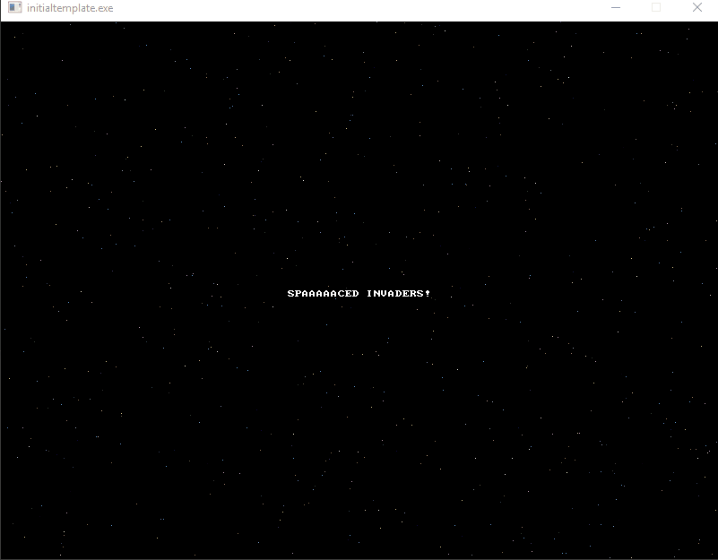

# Your first real program

## Summary

In this article, we move from web-based C++ tools, to something you can run on your own machine, using Visual Studio 2017.

In order to help speed up your ability to work with the codebase, I've created a Visual Studio 2017 project template you can work with. It's located in the `templates` folder in this repo. It's called `SpacedInvadersTemplate.zip`.

In order to use it, you'll need to copy it into your `Documents\Visual Studio 2017\Templates\ProjectTemplates` folder. If you have Visual Studio already running, you'll need to restart the IDE (not your computer).

From that point on, if you want to create a new project to work from, all you have to do is select the template and it will automatically create a starter project for you:


This is just a simpler way to create new projects that are going to follow a standard format. That format includes having the appropriate libraries ready to go, paths set up and a fair bit of boilerplate code inserted for you already.

The template is based off the `initialtemplate` project in the included solution `spacedinvaders`. Go ahead and open that solution in Visual Studio 2017.

Here's what we end up with, when we run the program:



So, how do we get there from here? There's actually a fair bit of ground to cover, and we'll introduce a few more C/C++ concpets along the way.

## The Executable

We're going to continue with our previous examples by creating a windows console application. It's going to have the standard `main` entry point; there won't be any OS specific code in our example.

However, in order to do that, we need to use a 3rd party library called [Allegro](http://liballeg.org/). Our project already has a number of features enabled, but eventually we'll talk about that (way down the line in our article series). Those features will be enabled through a series of functions. And, much like our previous example of using `printf`, we are going to need to include some headers in order for our program to know how to access them.

We therefore need to include some header files:

``` C++
// spacedinvaders.cpp : Defines the entry point for the console application.
//

#include "stdafx.h"

#include <stdio.h>
#include <allegro5/allegro.h>
#include <allegro5/allegro_image.h>
#include <allegro5/allegro_primitives.h>
#include <allegro5/allegro_font.h>
```

- Our first include, `stdafx.h` is part of what Microsoft calls a 'precompiled header' - it's nothing more than a caching system to increase build times. For now it's kind of irrelevant, so we can ignore it. NB: I may remove this as part of the template to increase the clarity of the article.

- Next up, we include `stdio.h`. We don't currently need it for our executable, it probably should be removed as it will increase build times, but I _may_ need it eventually. So I like to have it on hand.

- The next four includes actually are used for Allegro features. In order, they are: the core Allegro system, any image manipulation functions, rendering primitives and text rendering. Like `stdio.h`, not all are used, but I find it useful to have they preset as part of the template.

  - One thing you'll probably notice is that the first include uses quotation marks around `stdafx.h` and the later ones all use angled brackets (`<` and `>`). This is purely for defining where the compiler looks for the header files. Quotation marks indicates that you should look relative to the current file. Angled braces indicates that you should use the 'project defined include paths' that you can set up in the project options (or part of the default compiler/solution setup).

  - Later we'll be creating our own header files, so we'll end up using quotation marks. (or will we ...)

Next up we have something called 'Forward Declarations'. Here's something about C/C++ - you cannot use something until you declare it. You have to define variable before you use them, right? Well, you have to do the same thing with functions:

``` C++
// Forward Declarations
void Setup();
void Teardown();
```

This code is telling C/C++ 'Hey, you know, I'm going to tell you that I have these functions. I'm not going to define the body of these functions just yet, but they're coming up ... eventually".

  - What happens is that when you actually build your program, you run through a couple of steps. First up, the 'compiler' will go through your code and compile all the files with the `cpp` extension (or `cc`, or `c` depending on how your compiler is set up). Compiling creates a set of `.obj` files; object files which are files that have been converted into ... almost ... something you can run. We then go through another step, a 'link' step, which then takes all the object files (the `.obj` files) and any libraries that we are looking to use, like Allegro, and inserts functions into the final exectuable.

Go back to the last example. When the compiler creates an exe that can use the `printf` function, the code that _is_ the printf instructions is actually inserted into the executable. That's done through the link step.

And all those 'Forward Declarations'? They can be put into a header file.  We'll revisit that in the not too distant future.

However, if you scroll to the bottom of the `main.cpp` file, youll see that we have the `Setup` and `Teardown` functions actually implemented.

## Global variables and variable scope

We then have a section that defines some 'Global Variables'. That's a bit of a misnomer as they aren't actually truly 'global' - they're what's called 'file global'. More on that shortly. However, what we have looks like this:

``` C++
// Global definitions
ALLEGRO_DISPLAY* gDisplay = nullptr;
ALLEGRO_FONT* gFont = nullptr;
ALLEGRO_EVENT_QUEUE* gEventQueue = nullptr;
```

Those ... kinda look like variables. But `ALLEGRO_DISPLAY`, `ALLEGRO_FONT` and `ALLEGRO_EVENT_QUEUE` don't look like the types we've seen already, like `float` or `int`.  What gives?

  - They actually are types. Just not native types like `float` and `int`. Remember, whit those types, you don't need to include any special headers to use them. However the ones we see above are of a _custom type_; they're defined as part of the allegro library, in `#include <allegro5/allegro.h>`. We'll talk about creating our own type very soon, but it's just a hint outside of the scope of this article. We will, however, gladly use them for our own purposes.

But they're not just a type - they have an asterix at the end: `ALLEGRO_DISPLAY*` ... isn't that a mathematical operator for multiplication? Remeber our last article! That's a _pointer_ variable declaration - `gDisplay` is a pointer to an `ALLEGRO_DISPLAY` type! This is going to become apparent soon.

## The Main body of work

Our `main` function is actually quite simple, with a few caveats:

``` C++
int main()
{
    Setup();

    while (true)
    {
        ALLEGRO_EVENT event;
        ALLEGRO_TIMEOUT timeout;
        al_init_timeout(&timeout, 0.06);
        bool get_event = al_wait_for_event_until(gEventQueue, &event, &timeout);    
        if (get_event && event.type == ALLEGRO_EVENT_DISPLAY_CLOSE)
        {
            break;
        }
        for (int index = 0; index < 25; index++)
        {
            al_put_pixel(rand() % 800, rand() % 600, al_map_rgb(rand() % 255, rand() % 255, rand() % 255));
        }
        al_flip_display();
    }

    Teardown();

    return 0;
}
```

This `main` function contains a call to the `Setup` and `Teardown` functions. We're going to ignore those for the purpose of this article, but we will go into depth on them in the near future.

We then have a while loop that iterates ... forever?

Yep! This is the case. So how does our program ever stop? You can actually exit from any loop by using the `break` instruction, as we see here:

``` C++
ALLEGRO_EVENT event;
ALLEGRO_TIMEOUT timeout;
al_init_timeout(&timeout, 0.06);
bool get_event = al_wait_for_event_until(gEventQueue, &event, &timeout);    
if (get_event && event.type == ALLEGRO_EVENT_DISPLAY_CLOSE)
{
    break;
}
```

Let's break that down one line at a time.

``` C++
ALLEGRO_EVENT event;
```

What is an `ALLEGRO_EVENT`? It's a way to hook into Allegro's event system. So what's an event? The Operating System can have 'things' happen. Like creating a window, clicking on somewhere in the window, or pressing the `X` on the window to close it. When that happens, Allegro creates an 'event' that we can watch for. I'm really glossing over this for now, but again, we'll dig deeper into it shortly.

``` C++
ALLEGRO_TIMEOUT timeout;
```

Same thing here, except that we have a type called `ALLEGRO_TIMEOUT`.

``` C++
al_init_timeout(&timeout, 0.06);
```

So let's read this out loud:
"We call the function `al_init_timeout` with the first argument being the address of the variable `timeout` and a floating point value (not a variable) of 0.06".

Why are we passing in a memory address here? Why can't we just pass in the variable?

This has to do with how arguments are passed into functions. See, passing in `timeout` will pass in a copy of that variable. It will create a new variable in the funtion `al_init_timeout` and copy the value of `timeout` into it. If the function modifies that copy, it does just exactly that. It only modified the copy. Not the original. To get around that, we pass in the memory address. You can copy the memory address to your heart's delight, as that isn't what `al_init_timeout` will be setting. It will be setting what the memory address points to.

I think I'm going to need another example to better illustrate that. Over to the web we go!

### Sidebar code # 2

Let's examine some new code:

``` C++
// Example program
#include <stdio.h>

void foo(int value)
{
    value = 22;
}

void bar(int* value)
{
    *value = 22;
}

int main()
{
    int originalValue = 7;

    printf("originalValue: %d\n", originalValue);

    foo(originalValue);
    printf("originalValue after calling 'foo': %d\n", originalValue);

    bar(&originalValue);
    printf("originalValue after calling 'bar': %d\n", originalValue);
}
```

This program results in the following output:

```
originalValue: 7
originalValue after calling 'foo': 7
originalValue after calling 'bar': 22
```

[modifying values via a function](http://cpp.sh/945ti)

The difference between the functions `foo` and `bar` is that one takes an integer type and the other takes an integer _pointer_ type. Both functions change the value passed in to 22, but in `foo`, you are modifying a *local* copy of the integer. You are also using a local copy in `bar`, but it's a local copy of the memory address, which you derefernce and change. That has the effect of changing the original value.

Let's state that again. Whenever you pass in a variable to a function, you are always passing in a copy of the variable <sup>*</sup>

Passing in a copy of the memory address, in the case of the `bar` function is still the same memory address. So when we dereference it, we're still accessing the same point in memory, and chaning that.  This is one of those times pointers are really useful; they allow use to change the value of something we pass in. In computer science, the first type of arguement passing is called 'pass by value'. The second type, where we are passing along a memory addres (or expecting to change the value) is called 'pass by reference'. We're essentially passing in a refernce to where the variables data is stored.

### We return to our regularly scheduled article

So what we're seeing here is one method of being able to modify values that are outside of the _scope_ of a function. In our original case, the Allegro library function is _initializing_ the `timeout` variable with the 0.06 (how many seconds to wait for an event) value we passed in. I expect that it does a lot more than that, but for now, let's assume that it's a black box doing 'stuff'.

``` C++
bool get_event = al_wait_for_event_until(gEventQueue, &event, &timeout);
```

`gEventQueue` is a variable I've set up that is nothing more than a list of events that gets recalulated every time this function is called. As I've said before, events in Allegro are meant to represent specific 'things' your application can do, or respond to, like the window closing (see the next code snippet for an example).

`al_wait_for_event_until` is a function that will exectute until Allegro has an event that it can respond to, or a timeout is reached. If any event happened, it returns true (which gets stored into `get_event`). Otherwise it returns false.

``` C++
if (get_event && event.type == ALLEGRO_EVENT_DISPLAY_CLOSE)
{
    break;
}
```

We now see a more complex `if` condition. This is were we get to see some real logic at play. We can read that condition like so:

"If the boolean variable `get_event` is true, and the the variable `event` has a property on it called `type` is equal to `ALLEGRO_EVENT_DISPLAY_CLOSE`, then we do something. In this case, we break out of the loop".

What, then, is `ALLEGRO_EVENT_DISPLAY_CLOSE`.

This also has a lot to dissect.

What does the `&&` operator mean? Previously we've seen a single `&` represent a 'get me the memory address of a thing'. Is that doing it, but twice?

No. It's not.

What it is doing is representing a boolean *AND* operation. C++ also defines a boolean *OR* operation using the `||` operation.

I'll go into more detail about boolean operations in another article. But for now, whenever you see an *AND* operation, the condition on the left AND right must evaluate to true. The *OR* operation means that either the left, the right, or both conditions must be true.

Next, we have that double `=` sign. That's not a double assignment. That's an equivalency operation. Does what's on the left equal what's on the right.  Please note, you will often type `=` when you mean `==`. This isn't a 'newbie' problem. It happens all the time, when you switch programming languages for any stretch.

Finally, what in the word is `event.type`? I mean, `event` is a variable of type `ALLEGRO_EVENT`. But what does that period mean? And what in the world is that `type`?

At this point, the types that you've seen are fairly rudimentary. They consist of one 'thing' A floating point number, a boolean value, an integer value.

But you can also have 'complex' or 'structured' data types. That's what `ALLEGRO_EVENT` is. Sort of.

Let's say we wanted to be able to represent a point in 2D cartesean space. That has an X and a Y component.  You could do something like this, every time you wanted to represent a 2D point:

``` C++
float playerX;
float playerY;
```

Now let's create the position for an enemy.

``` C++
float enemyX;
float enemyY;
```

or, we wanted to create 5 enemies ...

``` C++
float redEnemyX;
float redEnemyY;

float blueEnemyX;
float blueEnemyY;

float greenEnemyX;
float greenEnemyY;

float yellowEnemyX;
float yellowEnemyY;

float orangeEnemyX;
float orangeEnemyY;
```

That is a lot of variables. And it was a bugger to type all that. And I made a lot of mistakes typing them out.

And each of those points shared the same thing, a float that represented the X and Y positions. Wouldn't it have been easier to have a 'structured' data type that created a cookie cutter outline for that?  It sure does, and that's where the `struct` keyword comes into play.

``` C++
#include <stdio.h>

struct Point2D
{
    float X;
    float Y;
};

int main()
{
    Point2D player;

    Point2D redEnemy;
    Point2D blueEnemy;
    Point2D greenEnemy;
    Point2D yellowEnemy;
    Point2D orangeEnemy;

    player.X = 0.0f;
    player.Y = 0.0f;

    redEnemy.X = 10.0f;
    redEnemy.Y = -10.0f;

    printf("player position: [%f,%f]\n", player.X, player.Y);
    printf("redEnemy position: [%f, %f]\n", redEnemy.X, redEnemy.Y);

    return 0;
}
```

```
player position: [0.000000,0.000000]
redEnemy position: [10.000000, -10.000000]
```

[another sidecar project](http://cpp.sh/8625)

If you look at how we defined the struct, it kind of looks like a funtion. The struct has a body (everything between the curly braces), and it has a name `Point2D`. But that's where the similarities end. There is no return type, there are no agruments.

You create a variable of this type like you would any other variable. But to access its 'fields', you need that `.` operator.

And that's what's happening with `ALLEGRO_EVENT`. Sorta (it's actually not a struct, but a `union` - we can discuss that in a future article, but it was a great introduction to Data Structures).

Whew. Almost there.

## The rest of the main function

``` C++
    for (int index = 0; index < 25; index++)
    {
        al_put_pixel(rand() % 800, rand() % 600, al_map_rgb(rand() % 255, rand() % 255, rand() % 255));
    }
    al_flip_display();
```

We're still inside the infinte `while` loop. And now we have a `for` loop. It iterates 25 times, calling `al_put_pixel` on each iteration. That simply draws a pixel in the window, at a specific 2D position in a specified RGB color.

You can also see that we call a function called `rand` and we have yet another operator, the `%`. Let's look at these one at a time.

`rand` is part of the `stdio.h` library. It's a random number generator. It generates a semi-random integer between 0 and a number identified as `RAND_MAX`. Every OS defines `RAND_MAX` a little differently. But it's a large number.

`%` is what's called the 'modulus' operator. This is nothing more than the 'remainder' operation. But it's not the decimal value - it's the whole number.

Here's a for instance: If you take 11 and divide by 3, what's the remainder? Well, 11 doesn't evenly divide by 3. 9 does, but there's still 2 left over. And 2 is what you'd get with the modulus operator: (11 % 3) == 2.  Feel free to try that out in the C++ shell.

And that's kind of cool - if you take a random integer and take the modulus of another integer, it will give you a value 'in the range' of 0 - whatever that other integer is. ie: `rand() % 800 == <a value between 0 and 800>`

Once we're done that 'inner loop', we finally call one last Allegro library - `al_flip_display`. It's sort of complicated what that's doing, but for now let's just say that it paints the image into the window (you can think of it like a 'draw' command).

## Wrap up

OK, that took a lot of twists and turns. In my next article, I'm going to spend more time talking about structs, functions and how a little bit about how images, graphics and rudimentary rendering work.

I also hope to have far fewer sidecar projects in C++ Shell. But I have a funny feeling we will.

You can head back to the main article page [here](README.md) and continue on with the next article.

Later!

-Ash