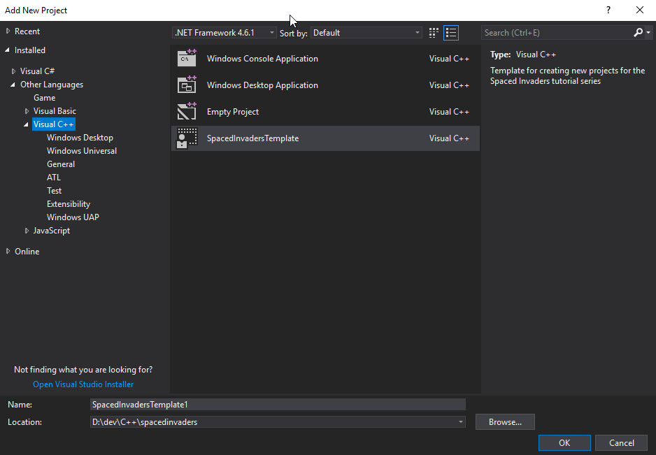
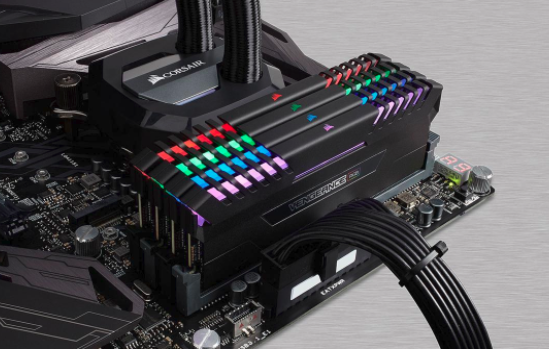

# Your first real program

## Review

Hey, so from the last article, I left you with a question. In the following code, there's a big bug. Were you able to find it?

``` C++
// Calculating an exponent
#include <stdio.h>

float calcPow(float base, float exponent)
{
    int iterations = exponent;
    if (exponent < 0)
    {
        iterations *= -1.0f;
    }

    float result = base;
    for (int index = 0; index < (iterations - 1); index++)
    {
        result *= base;
    }

    if (exponent < 0)
    {
        result = 1.0f / result;
    }
    return result;
}

int main()
{
    printf("5 to the power of 3 is: %f\n", calcPow(5, 3));
    printf("5 to the power of -3 is: %f\n", calcPow(5, -3));
}
```

Let me give you a hint. What happens if you were to use 0 as the exponent? Or the base? Or calculate a negative exponent?

So, if we were to replace the `main` function above with this:

``` C++
    printf("5 to the power of 0 is: %f\n", calcPow(5, 0));
    printf("0 to the power of -3 is: %f\n", calcPow(0, 3));
    printf("0 to the power of -3 is: %f\n", calcPow(0, -3));
```

Our output looks like this:

```
5 to the power of 0 is: 5.000000
0 to the power of -3 is: 0.000000
0 to the power of -3 is: inf
```

Division by zero actually is bad, mathematically (it's undefined). In C++, dividing a floating point number by a zero (floating point number) will actually return a floating point value that the compiler recognizes as infinity.

If we were to modify the program above to actually divide an integer by 0 ...

``` C++
    printf("5 to the power of 0 is: %f\n", calcPow(5, 0));
    printf("0 to the power of -3 is: %f\n", calcPow(0, 3));
    printf("0 to the power of -3 is: %f\n", calcPow(0, -3));
    printf("5 divideb by 0 is: %d\n", 5/0);
```

Doesn't actually spew out any output. Check out the link [here](http://cpp.sh/46orl).

We are given a warning about dividing by zero tho.

OK, on to the next, new thing!

## Summary

In this article, we move from web-based C++ tools, to something you can run on your own machine, using Visual Studio 2017.

In order to help speed up your ability to work with the codebase, I've created a Visual Studio 2017 project template you can work with. It's located in the `templates` folder in this repo. It's called `SpacedInvadersTemplate.zip`.

In order to use it, you'll need to copy it into your `Documents\Visual Studio 2017\Templates\ProjectTemplates` folder. If you have Visual Studio already running, you'll need to restart the IDE (not your computer).

From that point on, if you want to create a new project to work from, all you have to do is select the template and it will automatically create a starter project for you:



This is just a simpler way to create new projects that are going to follow a standard format. That format includes having the appropriate libraries ready to go, paths set up and a fair bit of boilerplate code inserted for you already.

The template is based off the `initialtemplate` project in the included solution `spacedinvaders`. Go ahead and open that solution in Visual Studio 2017.

Here's what we end up with, when we run the program:


So, how do we get there from here? There's actually a fair bit of ground to cover, and we'll introduce a few more C/C++ concpets along the way.

## The Executable

We're going to continue with our previous examples by creating a windows console application. It's going to have the standard `main` entry point; there won't be any OS specific code in our example.

However, in order to do that, we need to use a 3rd party library called [Allegro](http://liballeg.org/). Our project already has a number of features enabled, but eventually we'll talk about that (way down the line in our article series). Those features will be enabled through a series of functions. And, much like our previous example of using `printf`, we are going to need to include some headers in order for our program to know how to access them.

We therefore need to include some header files:

``` C++
// spacedinvaders.cpp : Defines the entry point for the console application.
//

#include "stdafx.h"

#include <stdio.h>
#include <allegro5/allegro.h>
#include <allegro5/allegro_image.h>
#include <allegro5/allegro_primitives.h>
#include <allegro5/allegro_font.h>
```

Our first include, `stdafx.h` is part of what Microsoft calls a 'precompiled header' - it's nothing more than a caching system to increase build times. For now it's kind of irrelevant, so we can ignore it. NB: I may remove this as part of the template to increase the clarity of the article.

Next up, we include `stdio.h`. We don't currently need it for our executable, it probably should be removed as it will increase build times, but I _may_ need it eventually. So I like to have it on hand.

The next four includes actually are used for Allegro features. In order, they are: the core Allegro system, any image manipulation functions, rendering primitives and text rendering. Like `stdio.h`, not all are used, but I find it useful to have they preset as part of the template.

One thing you'll probably notice is that the first include uses quotation marks around `stdafx.h` and the later ones all use angled brackets (`<` and `>`). This is purely for defining where the compiler looks for the header files. Quotation marks indicates that you should look relative to the current file. Angled braces indicates that you should use the 'project defined include paths' that you can set up in the project options (or part of the default compiler/solution setup).

Later we'll be creating our own header files, so we'll end up using quotation marks. (or will we ...)

Next up we have something called 'Forward Declarations`. Here's something about C/C++ - you can use something until you declare it. You have to define variable before you use them, right? Well, you have to do the same thing with functions. Thus:

``` C++
// Forward Declarations
void Setup();
void Teardown();
```

Is just telling the compiler that 'Hey, you know, I'm going to tell you that I have these functions. I'm not going to define the body of these functions just yet, but they're coming up ... eventually".

See, what happens is that when you actually build your program, you run through a couple of steps. First up, the 'compiler' will go through your code and compile all the files with the `cpp` extension (or `cc`, or `c` depeding on ... things). Compiling creates a set of `.obj` files; object files which are files that have been converted into ... almost ... something you can run. We then go through another step, a 'link' step, which then takes all the object files (the `.obj` files) and any libraries that we are looking to use, like Allegro, and inserts functions into the final exectuable.

Go back to the last example. When the compiler creates an exe that can use the `printf` function, the code that _is_ the printf instructions is actually inserted into the executable. That's done through the link step.

And all those 'Forward Declarations'? They can be put into a header file.  We'll revisit that in the not too distant future.

However, if you scroll to the bottom of the `main.cpp` file, youll see that we have the `Setup` and `Teardown` functions actually implemented.

## Global variables and variable scope

We then have a section that defines some 'Global Variables'. That's a bit of a misnomer as they aren't actually truly 'global' - they're what's called 'file global'. More on that shortly. However, what we have looks like this:

``` C++
// Global definitions
ALLEGRO_DISPLAY* gDisplay = nullptr;
ALLEGRO_FONT* gFont = nullptr;
ALLEGRO_EVENT_QUEUE* gEventQueue = nullptr;
```

Those ... kinda look like variables. But `ALLEGRO_DISPLAY`, `ALLEGRO_FONT` and `ALLEGRO_EVENT_QUEUE` don't look like the types we've seen already, like `float` or `int`.  What gives?

Well, they actually are types. Just not native types like `float` and `int`.  You don't need to include any special headers to use those types. However it is a _custom type_, that's defined as part of the allegro library, in `#include <allegro5/allegro.h>`. We'll talk about creating our own type very soon, but it's just a hint outside of the scope of this article. We will, however, gladly use them for our own purposes.

But, they're not just a type - they have an asterix at the end: `ALLEGRO_DISPLAY*` ... isn't that a mathematical operator for multiplication?

It sure is. But in C/C++, you'll find that symbols often have different meanings depending on the context.  In this context, it represents a pointer.

OK, so what's a pointer? Wikipedia defines it as:

> In computer science, a pointer is a programming language object, whose value refers to (or "points to") another value stored elsewhere in the computer memory using its memory address. A pointer references a location in memory, and obtaining the value stored at that location is known as dereferencing the pointer. As an analogy, a page number in a book's index could be considered a pointer to the corresponding page; dereferencing such a pointer would be done by flipping to the page with the given page number and reading the text found on the indexed page.

So, what's stored in a pointer variable is a memory address. A pointer, depending on the operating system, can be of different sizes. You know how you can get a 32 or 64 bit version of windows? Yep, that is how big a pointer is (32 bits for a 32 bit OS, 64 in a 64 bit os).

That's an incredibly naive way to describe the difference between 32 and 64 bit operating systems. But at it's core, it's not wrong. It's just that there's a lot more going on than just that. In a later article, I'll talk more about 32 and 64 bit pointers and address spaces.

So what, then, does a pointer actually mean? Well, it points to a bit of memory.

Let's just over to the C++ shell to illustrate how pointers work (in a rudimentary fashion).

``` C++
// Example program
#include <stdio.h>

// File Global variables
int gA;             // a file global integer variable
int gB;             // a file global integer variable
int* gPointer;      // a file global integer pointer


int main()
{
  gA = 5;
  gB = 10;

  gPointer = &gA;

  printf("gA: %d\n", gA);
  printf("gB: %d\n", gB);
  printf("gPointer: %p\n", gPointer);
  printf("Value gPointer points to: %d\n", *gPointer);

  gPointer = &gB;
  printf("gPointer: %p\n", gPointer);
  printf("Value gPointer points to: %d\n", *gPointer);

  *gPointer = 15;

  printf("gA: %d\n", gA);
  printf("gB: %d\n", gB);
  printf("gPointer: %p\n", gPointer);
  printf("Value gPointer points to: %d\n", *gPointer);
}
```

Results in:
```
gA: 5
gB: 10
gPointer: 0x600b4c
Value gPointer points to: 5
gPointer: 0x600b48
Value gPointer points to: 10
gA: 5
gB: 15
gPointer: 0x600b48
Value gPointer points to: 15
```

[Link to example](http://cpp.sh/86otz)

That is going to need a little bit of unpacking. First off, we have three variables defined:

``` C++
// File Global variables
int gA;             // a file global integer variable
int gB;             // a file global integer variable
int* gPointer;      // a file global integer pointer
```

`gA` and `gB` are just integer variables. Why did I name them that way? Why is there a `g` in front of `A` and `B`.  This is just a convention that I have. The `g` represents a `g`lobal variable. It's only for readability for the person next reading this code; it doesn't mean a thing to the compiler. Once we get more familiar with the language, I'll talk a bit more about coding conventions.

`gPointer` is an integer variable _pointer_. This simply states that this variable will hold the address of a memory location that is an integer. That's it.

Doing something like this:

``` C++
float someVariable;
float* someVariablePointer;
```

Means that `someVariablePointer` will point to a `float` type in memory.

Confused yet? That's OK, because it can be. And it'll get more complex when we talk about 'dynamic memory allocation'. But we aren't going there just yet.

Let's go back to how we declare variables. Looking at how we declared `gA` and `gB`:

``` C++
int gA;             // a file global integer variable
int gB;             // a file global integer variable
```

Each of those two lines creates a variable in memory. That 'in memory' is kind of a broad term, as computer programs tend to have two types of memory: the 'stack' and the 'heap'. Before we get into the differen types of memory, we should really talk a little about what memory _is_.

### Theory time

We've all seen these guys, right:



This is RAM memory. RAM, of course, stands for 'Random Access Memory', which means that you can access the memory in any random fashion you like. You can read and write to it (there's also ROM - Read Only Memory, but that's traditionally used for other things, like you bios), and it's very fast. Not the fastest memory, but it's pretty dang quick.

But what _is_ memory? It's a lot of bits put together in a linear collection. A bit can be on or off, 1 or 0, true of false (this is also considered a boolean value). Put 8 bits together and you have a byte.

And as far as C/C++ is concerned, a byte is the smallest unit you can work with, from a storage standpoint. You can work with individual bits, but ... not individually. This is something else we'll talk about later, but for now, assume that all you are able to read/write from memory, at it's atomic level, are bytes.

Bytes can do a lot of things. A byte can hold an ASCII character (what you're looking at now is a bunch of bytes - each letter is a byte). It can also represent an unsigned number: 0 - 255. It can also represent a signed number (-128 to 127).

How does that work? Let's look at how we can store an unsigned number:

```
bit 7  6  5  4  3  2  1  0
   [0][0][0][0][0][0][0][0]
```

That's a layout of a byte, in memory (using my fantastic ASCII art skils). Now, here's the thing - using bits, we can count in binary (0 and 1), much like we can using our base 10 system.

Consider this base 10 example:

<pre>
factor of 10: 7  6  5  4  3  2  1  0
             [0][0][0][0][0][0][0][1]  = 1      = 10<sup>0</sup>
             [0][0][0][0][0][0][1][0]  = 10     = 10<sup>1</sup>
             [0][0][0][0][0][1][0][0]  = 100    = 10<sup>2</sup>
             [0][0][0][0][1][0][0][0]  = 1000   = 10<sup>3</sup>
             [0][0][0][1][0][0][0][0]  = 10000  = 10<sup>4</sup>
</pre>

This is analagous to 10<sup>x</sup>, where the value of `x` would be the position in that table of a non-zero value.

Right, but how does that work for non factor of 10 numbers? Well, the formula would look like this:

> n * 10<sup>position</sup>

For example:

<pre>
factor of 10: 7  6  5  4  3  2  1  0
             [0][0][0][0][0][0][0][5]  = 5      = 5 * 10<sup>0</sup>
             [0][0][0][0][0][0][2][0]  = 20     = 2 * 10<sup>1</sup>
             [0][0][0][0][0][8][0][0]  = 800    = 8 * 10<sup>2</sup>
             [0][0][0][0][9][0][0][0]  = 9000   = 9 * 10<sup>3</sup>

</pre>

More complex numbers is nothing but a summation of each element, using the same formula:

<pre>
factor of 10: 7  6  5  4  3  2  1  0
             [0][0][0][0][0][4][0][3]  = 403   = 0 * 10<sup>7</sup> + 0 * 10<sup>6</sup> + 0 * 10<sup>5</sup> + 0 * 10<sup>4</sup> + 0 * 10<sup>3</sup> + 4 * 10<sup>2</sup> + 0 * 10<sup>1</sup> + 2 * 10<sup>0</sup>
</pre>

Now, how does that map to a binary value? Well, it's exactly the same thing, except that we only can put a 0 or 1 as the `n` value of the earlier equation <pre>n * 10<sup>position</sup></pre>. Thus, for binary representation, we can simplify it down to: <pre>10<sup>position</sup></pre>

And can be generalized as a sum across all positions.

As an example:

<pre>
bit 7  6  5  4  3  2  1  0
   [0][0][0][1][0][1][0][1] = (0 * 2<sup>7</sup>) + (0 * 2<sup>6</sup>) + (0 * 2<sup>5</sup>) + (1 * 2<sup>4</sup>) + (0 * 2<sup>3</sup>) + (1 * 2<sup>2</sup>) + (0 * 2<sup>1</sup>) + (1 * 2<sup>0</sup>)
                            = 0 + 0 + 0 + 16 + 0 + 4 + 0 + 1
                            = 21
</pre>

That is how whole, positive numbers are stored in binary. As an exercise for the reader, I'll let you expand on this to see why a byte can hold a minimum value of 0 and a maximum value of 255.

That was for a single byte of data. But the types we are using for the variables `gA` and `gB` are `int` types. They're much bigger than a byte. But how big are they? The answer is 'It depends'. For now, assume that an `int` takes up 4 bytes worth of space in memory. Also, what if we wanted to store a negative number? How do we do that? We use a method called "two's complement". I don't want to get into those topics right now. I think I'll dedicate an article later to it (it's pretty necessary when talking about storing data to a file).

### Back to the example in C++ shell

Looking back to the code, `gA` and `gB` are created on the stack. You don't have to do anyting special to create, or allocate, the space in memory for those variables. The compiler does that for you automatically. But they are created *on the stack*.

This means that the compiler will alocate enough room in memory to hold an integer varialbe ... *on the stack* ... automatically for you. And you can get and put data into it like we've seen already, by using the `=` operator, or just 'using' the variable, like we did with the `printf` function.

However, there are times when you want to store a pointer to a variable. Trust me, you're going to do this a _lot_ in C/C++. So if you want to create a pointer variable, you'll need to know the type, add a `*` after the type name and before the variable, like we did with `int* gPointer`.

As a side note, some coding conventions like to put the `*` symbol next to the type, some conventions like to put it next to the variable. It's totally a personal preference and if you look at some of my code samples in github, you'll see that I'm ... fluid ... in where I put the `*`. It's not uncommon to see pointers declared like:

``` C++
int* somePointer;
int *someOtherPointer;
```

It really comes down to coding style and conventions.

OK, back to the code and the output.

``` C++
int main()
{
  gA = 5;
  gB = 10;

  gPointer = &gA;
```

As you can see, we assign a value of `5` and `10` into `gA` and `gB` respectively.

On the subsequent line we now have that pointer variable getting assigned ... something. Let's answer a differe question right now: what does a pointer do? In it's simplest form, a pointer variable holds a memory address. Contrast that to what an integer variable holds; an integer value. So, if we were to have a pointer variable 'point to' the memory location of the integer variable, we need to get that memory address. That's what's happening in that line, we are using the `address of` operator to get the memory address of the variable `gA`, with the `&` operator.

Quick note: `&` is used in many, many different contexts. It's what we call 'overloaded'.

So, this line:

``` C++
  gPointer = &gA;
```

Can be read as: "The pointer variable `gPointer` is assigned the address of `gA`".

We are not storing the value _in_ `gA` to `gPointer`. We are storing the location, in memory, of where `gA` resides. That's it.

In the next bit of code, we actually print out what's in the variables:

``` C++
  printf("gA: %d\n", gA);
  printf("gB: %d\n", gB);
  printf("gPointer: %p\n", gPointer);
  printf("Value gPointer points to: %d\n", *gPointer);
```

In the third `printf` statement, you'll notice a new printing formatter, the `%p`. This means "print out the memory address provided by a pointer variable". And printing all this gives us this bit of output:

```
gA: 5
gB: 10
gPointer: 0x600b4c
Value gPointer points to: 5
```

Memory address are typically printed out in hexidecimal. That's base 16. Because we need another way to represent numbers. I'm not going into that right now, because I'm going to do an article later on numerical representation much, much later. However, base 16 means that each element in a number can have a 16 different values (0-9 plus A-F). There's also an Octal representation that only uses the values of 0-8 for each numerical element. Fun times ahead.

In the next bit of code, we do a little more with pointers:

``` C++
  gPointer = &gB;
  printf("gPointer: %p\n", gPointer);
  printf("Value gPointer points to: %d\n", *gPointer);
}
```

In the first line of the snippet above, we again store another memory address into `gPointer`. But this time it's the address of the integer variable `gB`. And then we print that out. Or do we? In the last `printf` of that snippet, we actually access `gPointer` with an `*` in front of it.  Doesn't that mean 'multiplication'? Not in this case. As with the `&` operation, `*` is also overloaded. When used in this context, it's called a `dereferencing operation`. That's fancy talk for "actually, get me what this pointer variable it pointing to". It can be read as "dereference `gPointer`", and it has the affect of making `gPointer` look like whatever it's pointing to; in this case, it's `gB`. To confirm that, let's look at the output:

```
gPointer: 0x600b48
Value gPointer points to: 10
```

We can see that the memory address is different and that what we dereference is actually a different value.

``` C++
  *gPointer = 15;

  printf("gA: %d\n", gA);
  printf("gB: %d\n", gB);
  printf("gPointer: %p\n", gPointer);
  printf("Value gPointer points to: %d\n", *gPointer);
}
```

In our last snippet of the main function, we see that we're dereferencing `gPointer` again. And assinging that result the value of `15`. Remeber, dereferencing a pointer transforms it into whatever it was the pointer referenced. In this case, that's `gB`. So we end up putting the value of `15` into `gB`.  Looking at our output confirms that:

```
gA: 5
gB: 15
gPointer: 0x600b48
Value gPointer points to: 15
```

That was quite the tangent. But I felt this was important to at the very least gloss over. Let's now get back to the actual topic of this article, the `main` function of our sample.

## The Main body of work

Our `main` function is actually quite simple, with a few caveats:

``` C++
int main()
{
    Setup();

    while (true)
    {
        ALLEGRO_EVENT event;
        ALLEGRO_TIMEOUT timeout;
        al_init_timeout(&timeout, 0.06);
        bool get_event = al_wait_for_event_until(gEventQueue, &event, &timeout);    
        if (get_event && event.type == ALLEGRO_EVENT_DISPLAY_CLOSE)
        {
            break;
        }
        for (int index = 0; index < 25; index++)
        {
            al_put_pixel(rand() % 800, rand() % 600, al_map_rgb(rand() % 255, rand() % 255, rand() % 255));
        }
        al_flip_display();
    }

    Teardown();

    return 0;
}
```

This `main` function contains a call to the `Setup` and `Teardown` functions. We're going to ignore those for the purpose of this article, but we will go into depth on them in the near future.

We then have a while loop that iterates ... forever?

Yep! This is the case. So how does our program ever stop? You can actually exit from any loop by using the `break` instruction, as we see here:

``` C++
ALLEGRO_EVENT event;
ALLEGRO_TIMEOUT timeout;
al_init_timeout(&timeout, 0.06);
bool get_event = al_wait_for_event_until(gEventQueue, &event, &timeout);    
if (get_event && event.type == ALLEGRO_EVENT_DISPLAY_CLOSE)
{
    break;
}
```

Let's break that down one line at a time.

``` C++
ALLEGRO_EVENT event;
```

What is an `ALLEGRO_EVENT`? It's a way to hook into Allegro's event system. So what's an event? The Operating System can have 'things' happen. Like creating a window, clicking on somewhere in the window, or pressing the `X` on the window to close it. When that happens, Allegro creates an 'event' that we can watch for. I'm really glossing over this for now, but again, we'll dig deeper into it shortly.

``` C++
ALLEGRO_TIMEOUT timeout;
```

Same thing here, except that we have a type called `ALLEGRO_TIMEOUT`.

``` C++
al_init_timeout(&timeout, 0.06);
```

So let's read this out loud:
"We call the function `al_init_timeout` with the first argument being the address of the variable `timeout` and a floating point value (not a variable) of 0.06".

Why are we passing in a memory address here? Why can't we just pass in the variable?

This has to do with how arguments are passed into functions. See, passing in `timeout` will pass in a copy of that variable. It will create a new variable in the funtion `al_init_timeout` and copy the value of `timeout` into it. If the function modifies that copy, it does just exactly that. It only modified the copy. Not the original. To get around that, we pass in the memory address. You can copy the memory address to your heart's delight, as that isn't what `al_init_timeout` will be setting. It will be setting what the memory address points to.

Siigh. I think I'm going to need another example to better illustrate that:

### Sidebar code # 2

``` C++
// Example program
#include <stdio.h>

void foo(int value)
{
    value = 22;
}

void bar(int* value)
{
    *value = 22;
}

int main()
{
    int originalValue = 7;

    printf("originalValue: %d\n", originalValue);

    foo(originalValue);
    printf("originalValue after calling 'foo': %d\n", originalValue);

    bar(&originalValue);
    printf("originalValue after calling 'bar': %d\n", originalValue);
}
```

Which results in:

```
originalValue: 7
originalValue after calling 'foo': 7
originalValue after calling 'bar': 22
```

[modifying values via a function](http://cpp.sh/945ti)

The difference between the functions `foo` and `bar` is that one takes an integer type and the other takes an integer _pointer_ type. Both functions change the value passed in to 22, but in `foo`, you are modifying a *local* copy of the integer. You are also using a local copy in `bar`, but it's a local copy of the memory address, which you derefernce and change. That has the effect of changing the original value.

### We return to our regularly scheduled article

So what we're seeing here is one method of being able to modify values that are outside of the _scope_ of a function. In our original case, the Allegro library function is _initializing_ the `timeout` variable with the 0.06 (how many seconds to wait for an event) value we passed in. I expect that it does a lot more than that, but for now, let's assume that it's a black box doing 'stuff'.

``` C++
bool get_event = al_wait_for_event_until(gEventQueue, &event, &timeout);
```

`gEventQueue` is a variable I've set up that is nothing more than a list of events that gets recalulated every time this function is called. As I've said before, events in Allegro are meant to represent specific 'things' your application can do, or respond to, like the window closing (see the next code snippet for an example).

`al_wait_for_event_until` is a function that will exectute until Allegro has an event that it can respond to, or a timeout is reached. If any event happened, it returns true (which gets stored into `get_event`). Otherwise it returns false.

``` C++
if (get_event && event.type == ALLEGRO_EVENT_DISPLAY_CLOSE)
{
    break;
}
```

We now see a more complex `if` condition. This is were we get to see some real logic at play. We can read that condition like so:

"If the boolean variable `get_event` is true, and the the variable `event` has a property on it called `type` is equal to `ALLEGRO_EVENT_DISPLAY_CLOSE`, then we do something. In this case, we break out of the loop".

What, then, is `ALLEGRO_EVENT_DISPLAY_CLOSE`.

This also has a lot to dissect.

What does the `&&` operator mean? Previously we've seen a single `&` represent a 'get me the memory address of a thing'. Is that doing it, but twice?

No. It's not.

What it is doing is representing a boolean *AND* operation. C++ also defines a boolean *OR* operation using the `||` operation.

I'll go into more detail about boolean operations in another article. But for now, whenever you see an *AND* operation, the condition on the left AND right must evaluate to true. The *OR* operation means that either the left, the right, or both conditions must be true.

Next, we have that double `=` sign. That's not a double assignment. That's an equivalency operation. Does what's on the left equal what's on the right.  Please note, you will often type `=` when you mean `==`. This isn't a 'newbie' problem. It happens all the time, when you switch programming languages for any stretch.

Finally, what in the word is `event.type`? I mean, `event` is a variable of type `ALLEGRO_EVENT`. But what does that period mean? And what in the world is that `type`?

At this point, the types that you've seen are fairly rudimentary. They consist of one 'thing' A floating point number, a boolean value, an integer value.

But you can also have 'complex' or 'structured' data types. That's what `ALLEGRO_EVENT` is. Sort of.

Let's say we wanted to be able to represent a point in 2D cartesean space. That has an X and a Y component.  You could do something like this, every time you wanted to represent a 2D point:

``` C++
float playerX;
float playerY;
```

Now let's create the position for an enemy.

``` C++
float enemyX;
float enemyY;
```

or, we wanted to create 5 enemies ...

``` C++
float redEnemyX;
float redEnemyY;

float blueEnemyX;
float blueEnemyY;

float greenEnemyX;
float greenEnemyY;

float yellowEnemyX;
float yellowEnemyY;

float orangeEnemyX;
float orangeEnemyY;
```

That is a lot of variables. And it was a bugger to type all that. And I made a lot of mistakes typing them out.

And each of those points shared the same thing, a float that represented the X and Y positions. Wouldn't it have been easier to have a 'structured' data type that created a cookie cutter outline for that?  It sure does, and that's where the `struct` keyword comes into play.

``` C++
#include <stdio.h>

struct Point2D
{
    float X;
    float Y;
};

int main()
{
    Point2D player;

    Point2D redEnemy;
    Point2D blueEnemy;
    Point2D greenEnemy;
    Point2D yellowEnemy;
    Point2D orangeEnemy;

    player.X = 0.0f;
    player.Y = 0.0f;

    redEnemy.X = 10.0f;
    redEnemy.Y = -10.0f;

    printf("player position: [%f,%f]\n", player.X, player.Y);
    printf("redEnemy position: [%f, %f]\n", redEnemy.X, redEnemy.Y);

    return 0;
}
```

```
player position: [0.000000,0.000000]
redEnemy position: [10.000000, -10.000000]
```

[another sidecar project](http://cpp.sh/8625)

If you look at how we defined the struct, it kind of looks like a funtion. The struct has a body (everything between the curly braces), and it has a name `Point2D`. But that's where the similarities end. There is no return type, there are no agruments.

You create a variable of this type like you would any other variable. But to access its 'fields', you need that `.` operator.

And that's what's happening with `ALLEGRO_EVENT`. Sorta (it's actually not a struct, but a `union` - we can discuss that in a future article, but it was a great introduction to Data Structures).

Whew. Almost there.

## The rest of the main function

``` C++
    for (int index = 0; index < 25; index++)
    {
        al_put_pixel(rand() % 800, rand() % 600, al_map_rgb(rand() % 255, rand() % 255, rand() % 255));
    }
    al_flip_display();
```

We're still inside the infinte `while` loop. And now we have a `for` loop. It iterates 25 times, calling `al_put_pixel` on each iteration. That simply draws a pixel in the window, at a specific 2D position in a specified RGB color.

You can also see that we call a function called `rand` and we have yet another operator, the `%`. Let's look at these one at a time.

`rand` is part of the `stdio.h` library. It's a random number generator. It generates a semi-random integer between 0 and a number identified as `RAND_MAX`. Every OS defines `RAND_MAX` a little differently. But it's a large number.

`%` is what's called the 'modulus' operator. This is nothing more than the 'remainder' operation. But it's not the decimal value - it's the whole number.

Here's a for instance: If you take 11 and divide by 3, what's the remainder? Well, 11 doesn't evenly divide by 3. 9 does, but there's still 2 left over. And 2 is what you'd get with the modulus operator: (11 % 3) == 2.  Feel free to try that out in the C++ shell.

And that's kind of cool - if you take a random integer and take the modulus of another integer, it will give you a value 'in the range' of 0 - whatever that other integer is. ie: `rand() % 800 == <a value between 0 and 800>`

Once we're done that 'inner loop', we finally call one last Allegro library - `al_flip_display`. It's sort of complicated what that's doing, but for now let's just say that it paints the image into the window (you can think of it like a 'draw' command).

## To wrap up

OK, that took a lot of twists and turns. In my next article, I'm going to spend more time talking about structs, functions and how a little bit about how images, graphics and rudimentary rendering work.

I also hope to have far fewer sidecar projects in C++ Shell. But I have a funny feeling we will.

-Ash