# A little bit of graphics

In this article, we're going to talk about graphics, because I think this will help make learning C/C++ a lot more fun.  I've always found it really, really cool to talk about graphics and all the weirdness that goes with it. So, if you'll indulge me, I'll begin to 'wax nostalgic'.

The ability to create motion on a computer screen, or TV, or in a movie is based on a property of the eye called 'Persistence of vision'. It's actually an optical illusion where a bunch of still images, played back sequenctially at a high rate, give the illusion of motion.

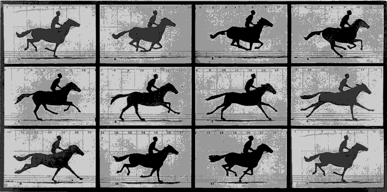

To have a better illusion of motion, you need to be able to display images at a faster rate than what you see in the above gif. To do this monitors draw an image on the screen at a certaion 'refresh rate'; the time between 'frames' of an image. A monitor that displays 60 frames per second (or a refresh rate of 60 Hz) will take 16.67 milliseconds to draw a frame. A 120 Hz monitor will take 8.33 milliseconds per frame. And so on. That means you have to do a lot of work, computationally, in a shorter period of time as framerates increase.

What makes up an image, then? Let's take as an example a low resolution picture of our family doggo, Leika:

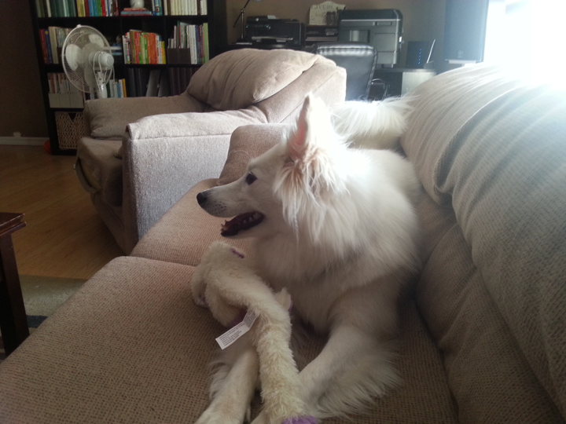

That image is 720 _pixels_ wide by 540 _pixels_ tall. A pixel is the smalles 'picture element' you have on a monitor/tv/raster output device. So you can consider that image to be an array of 720x540 pixels. If we zoom in on that image, we start to see the pixels:

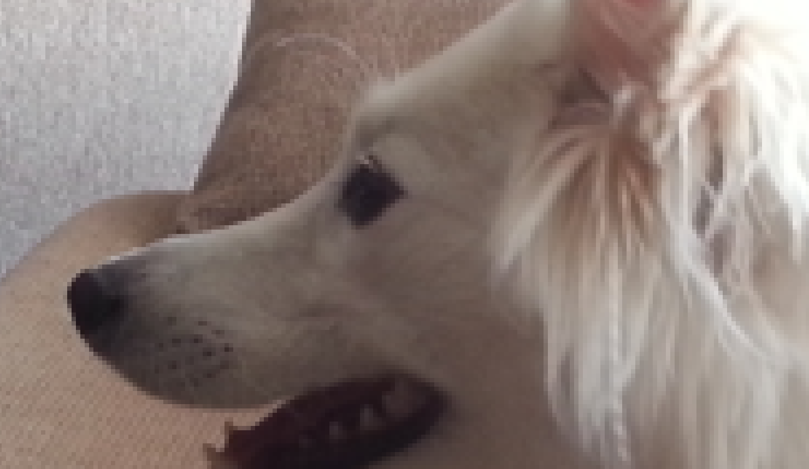

Each pixel can have a colour value. And how we store that color is ... interesting.

Each pixel in that image takes up a byte for a Red, Green, Blue and Alpha channel. That's 4 bytes per pixel worth of storage (or 32 bits per pixel - BPP for short). From an earlier article, we said that a byte can represent a value from 0 - 255, that means that we can have 256 discrete 'levels' of red, green, blue and alpha per pixel, or 16.7 million color variations - without including any transparency.  That's a lot of colours. It's also a lot of memory.

`720 x 540 x 8 bytes = 3,110,400 bytes (a little over 3 megabytes).`

That's what makes up an image, and that same principle applies to rendering graphics to a computer monitor, or an application window. The Allegro library that we use just makes that a lot easier for us to work with drawing content into the window.

## The New Project

I made a gif to help with showing how to set up the new project, using the project template I talked about in the [First Steps article](02.firststeps.md).

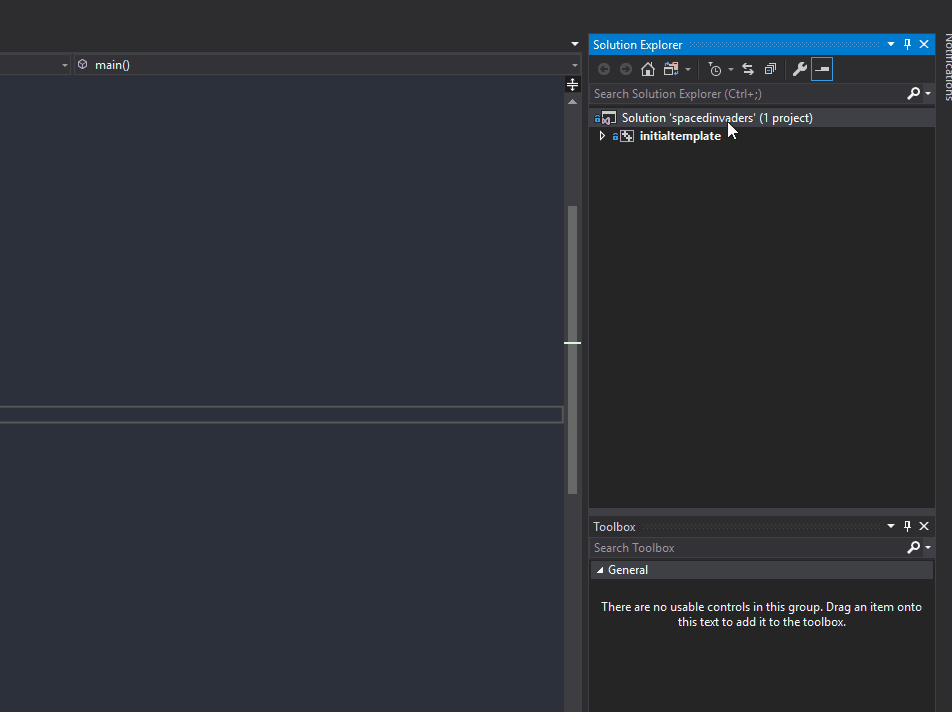

We do still have to set the project as the startup project, otherwise when we try and run the project, we won't actually be running our new project:

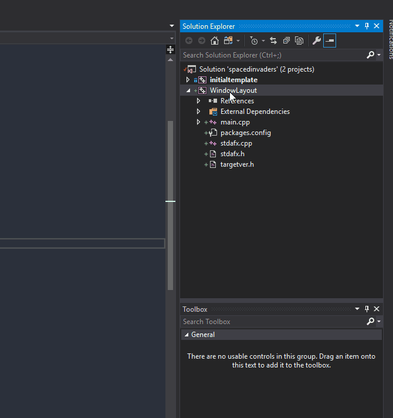

If you run that project, you get the same results as in the first steps article.

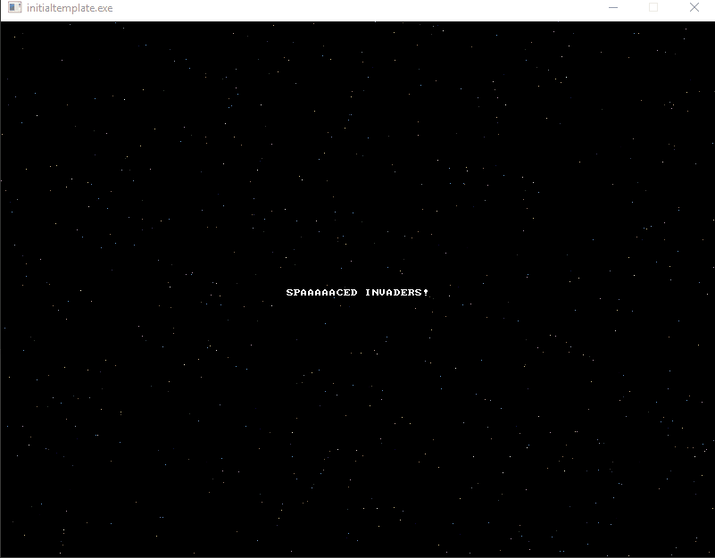


## Changing the default project behaviour

Let's draw dots, in different colours on the corners of the screen, to get an idea as to what the co-ordinate space looks like:

``` C++
int main()
{
	Setup();

	while (true)
	{
		ALLEGRO_EVENT event;
		ALLEGRO_TIMEOUT timeout;
		al_init_timeout(&timeout, 0.06);

		bool get_event = al_wait_for_event_until(gEventQueue, &event, &timeout);

		if (get_event && event.type == ALLEGRO_EVENT_DISPLAY_CLOSE)
		{
			break;
		}

		al_put_pixel(0, 0, al_map_rgb(255, 255, 255));
		al_put_pixel(0, 1, al_map_rgb(255, 255, 255));
		al_put_pixel(0, 2, al_map_rgb(255, 255, 255));
		al_put_pixel(1, 0, al_map_rgb(255, 255, 255));
		al_put_pixel(1, 1, al_map_rgb(255, 255, 255));
		al_put_pixel(1, 2, al_map_rgb(255, 255, 255));
		al_put_pixel(2, 0, al_map_rgb(255, 255, 255));
		al_put_pixel(2, 1, al_map_rgb(255, 255, 255));
		al_put_pixel(2, 2, al_map_rgb(255, 255, 255));

		al_put_pixel(797, 0, al_map_rgb(0, 255, 0));
		al_put_pixel(797, 1, al_map_rgb(0, 255, 0));
		al_put_pixel(797, 2, al_map_rgb(0, 255, 0));
		al_put_pixel(798, 0, al_map_rgb(0, 255, 0));
		al_put_pixel(798, 1, al_map_rgb(0, 255, 0));
		al_put_pixel(798, 2, al_map_rgb(0, 255, 0));
		al_put_pixel(799, 0, al_map_rgb(0, 255, 0));
		al_put_pixel(799, 1, al_map_rgb(0, 255, 0));
		al_put_pixel(799, 2, al_map_rgb(0, 255, 0));

		al_put_pixel(0, 597, al_map_rgb(255, 0, 0));
		al_put_pixel(0, 598, al_map_rgb(255, 0, 0));
		al_put_pixel(0, 599, al_map_rgb(255, 0, 0));
		al_put_pixel(1, 597, al_map_rgb(255, 0, 0));
		al_put_pixel(1, 598, al_map_rgb(255, 0, 0));
		al_put_pixel(1, 599, al_map_rgb(255, 0, 0));
		al_put_pixel(2, 597, al_map_rgb(255, 0, 0));
		al_put_pixel(2, 598, al_map_rgb(255, 0, 0));
		al_put_pixel(2, 599, al_map_rgb(255, 0, 0));

		al_put_pixel(797, 597, al_map_rgb(255, 255, 0));
		al_put_pixel(797, 598, al_map_rgb(255, 255, 0));
		al_put_pixel(797, 599, al_map_rgb(255, 255, 0));
		al_put_pixel(798, 597, al_map_rgb(255, 255, 0));
		al_put_pixel(798, 598, al_map_rgb(255, 255, 0));
		al_put_pixel(798, 599, al_map_rgb(255, 255, 0));
		al_put_pixel(799, 597, al_map_rgb(255, 255, 0));
		al_put_pixel(799, 598, al_map_rgb(255, 255, 0));
		al_put_pixel(799, 599, al_map_rgb(255, 255, 0));

		al_flip_display();
	}

	return 0;
}
```

When we run this program, we now get:

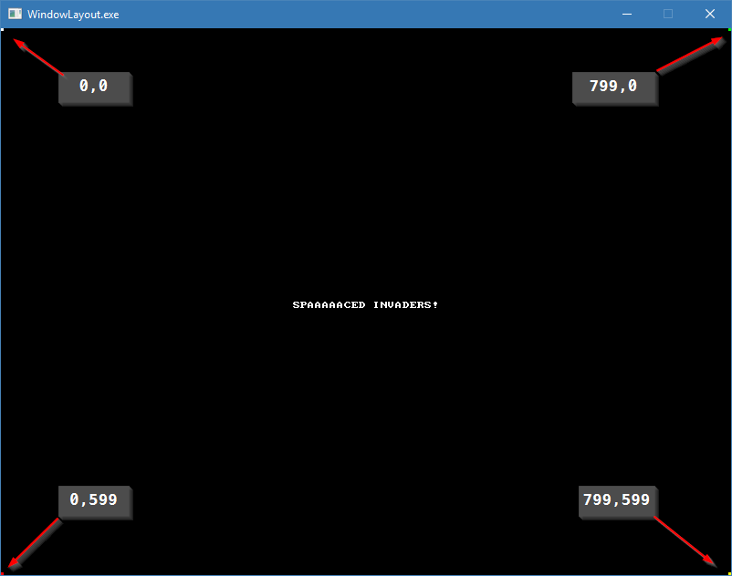

The window, by default, is set to 800x600. And the extents of the area we can draw to is 0-799 along the X-Axis and 0-599 along the Y axis.If we resize the screen to 1024x768:

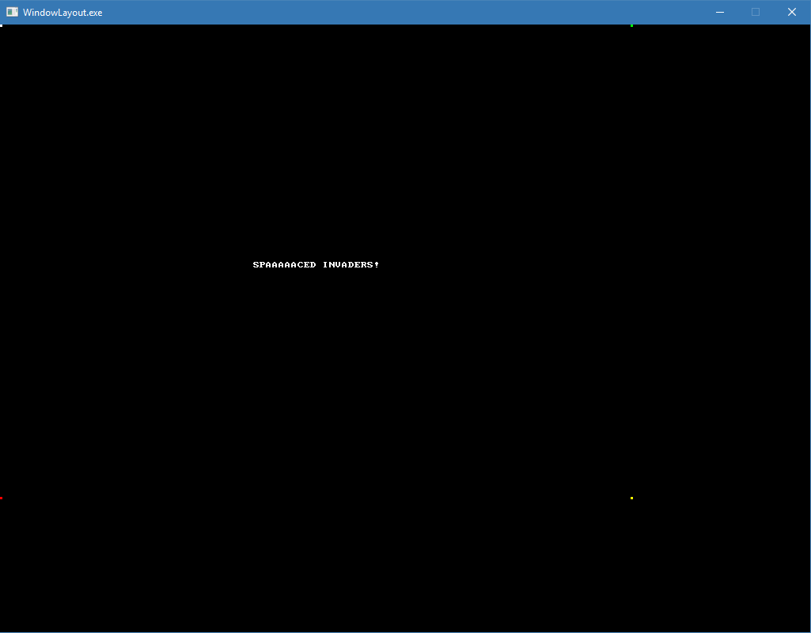

You can see that the coloured squares don't move.

We have now successfuly drawn a grouping of pixels onto the screen! Why don't we try moving them around?

## Animated Pixels

Let's do that. Here's some code to review:

``` C++
// spacedinvaders.cpp : Defines the entry point for the console application.
//

#include "stdafx.h"

#include <stdio.h>
#include <allegro5/allegro.h>
#include <allegro5/allegro_image.h>
#include <allegro5/allegro_primitives.h>
#include <allegro5/allegro_font.h>

// Forward Declarations
void Setup();
void Teardown();

// Global definitions
ALLEGRO_DISPLAY* gDisplay = nullptr;
ALLEGRO_FONT* gFont = nullptr;
ALLEGRO_EVENT_QUEUE* gEventQueue = nullptr;

struct Colour
{
	int R;
	int G;
	int B;
};

struct Pixel
{
	int X;
	int Y;
	Colour ElementColour;
};

void DrawPixel(Pixel* pixel, int deltaX, int deltaY)
{
	pixel->X += deltaX;
	pixel->Y += deltaY;

	int x = pixel->X;
	int y = pixel->Y;
	ALLEGRO_COLOR drawcolor = al_map_rgb(pixel->ElementColour.R, pixel->ElementColour.G, pixel->ElementColour.B);
	al_put_pixel(x, y, drawcolor);
	al_put_pixel(x, y + 1, drawcolor);
	al_put_pixel(x, y + 2, drawcolor);
	al_put_pixel(x + 1, y, drawcolor);
	al_put_pixel(x + 1, y + 1, drawcolor);
	al_put_pixel(x + 1, y + 2, drawcolor);
	al_put_pixel(x + 2, y, drawcolor);
	al_put_pixel(x + 2, y + 1, drawcolor);
	al_put_pixel(x + 2, y + 2, drawcolor);
}

int main()
{
	Setup();

	Pixel pixelsToDraw[4];

	for (int index = 0; index < 4; index++)
	{
		pixelsToDraw[index].X = 400;
		pixelsToDraw[index].Y = 300;
		pixelsToDraw[index].ElementColour.R = rand() % 255;
		pixelsToDraw[index].ElementColour.G = rand() % 255;
		pixelsToDraw[index].ElementColour.B = rand() % 255;
	}

	while (true)
	{
		ALLEGRO_EVENT event;
		ALLEGRO_TIMEOUT timeout;
		al_init_timeout(&timeout, 0.06);

		bool get_event = al_wait_for_event_until(gEventQueue, &event, &timeout);

		if (get_event && event.type == ALLEGRO_EVENT_DISPLAY_CLOSE)
		{
			break;
		}

		for (int index = 0; index < 4; index++)
		{
			int deltaX = (rand() % 8) - 4;
			int deltaY = (rand() % 8) - 4;

			DrawPixel(&pixelsToDraw[index], deltaX, deltaY);
		}
		al_flip_display();
	}

	return 0;
}

// Cut for brevity
```

And we get:

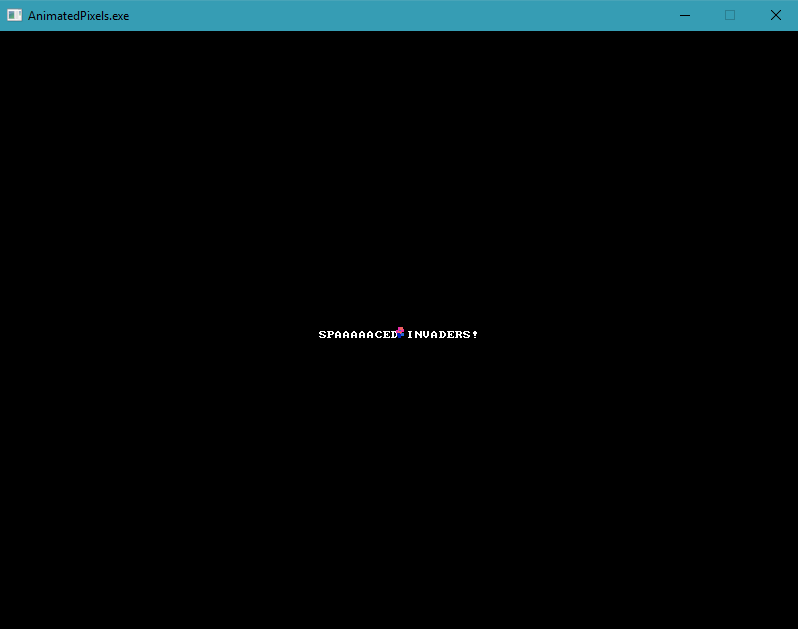

### The Breakdown

We've added into the templated code:

- two new structs - `Colour` and `Pixel`
- a new function called `DrawPixel`
- a heavily updated `main` function

If you take a look at the `Pixel` struct, you can also see that it contains an instance of the `Colour` struct. That's perfectly legal. You can access the contents of that struct with the `.` operator as well.

Let's look that the `main` function first, before we dig into the `DrawPixel` function.

`Pixel pixelsToDraw[4];`

That's creating an 4 element array called `pixelsToDraw`.

``` C++
for (int index = 0; index < 4; index++)
{
    pixelsToDraw[index].X = 400;
    pixelsToDraw[index].Y = 300;
    pixelsToDraw[index].ElementColour.R = rand() % 255;
    pixelsToDraw[index].ElementColour.G = rand() % 255;
    pixelsToDraw[index].ElementColour.B = rand() % 255;
}
```

This iterates over the 4 elements in the array, setting the position to be the middle of the screen and then initializing the colour to a random value.

We then get into the main `while` loop and we do our normal bookkeeping (set the timeout, event and breakout code).

Then we draw the pixels on screen:

``` C++
for (int index = 0; index < 4; index++)
{
    int deltaX = (rand() % 8) - 4;
    int deltaY = (rand() % 8) - 4;

    DrawPixel(&pixelsToDraw[index], deltaX, deltaY);
}
al_flip_display();
```

I want the direction to be positive or negative (so that it can spiral out). `rand() % 8` will give us a range between [0 - 7]. Subtracting 4 from that gives us a range of [-4 - 3].

Calling our `DrawPixel` function, we pass in, as the first arguement, the address of the array element (`&pixelsToDraw[index]`) as well as the delta X and Y. We pass it in as a pointer as I want to have the DrawPixel function update the position of the drawn pixel.

- Note: this is actually a bad thing to do, in terms of programming. Not because we're modifying a value, that's totally cool. But because we're editing a value _and_ drawing the pixel. The goal of a function is to do one thing, and one thing well. Modifying a value and then drawing it breaks this rule. However, I wanted to illustrate modifying an array element. In the future, I will strive to follow this rule in all examples. I may also modify this example in the future to follow this rule.

Since we call `DrawPixel`, we should see what it does. Let's look at it in detail:

``` C++
void DrawPixel(Pixel* pixel, int deltaX, int deltaY)
{
	pixel->X += deltaX;
	pixel->Y += deltaY;

	int x = pixel->X;
	int y = pixel->Y;
	ALLEGRO_COLOR drawcolor = al_map_rgb(pixel->ElementColour.R, pixel->ElementColour.G, pixel->ElementColour.B);
	al_put_pixel(x, y, drawcolor);
	al_put_pixel(x, y + 1, drawcolor);
	al_put_pixel(x, y + 2, drawcolor);
	al_put_pixel(x + 1, y, drawcolor);
	al_put_pixel(x + 1, y + 1, drawcolor);
	al_put_pixel(x + 1, y + 2, drawcolor);
	al_put_pixel(x + 2, y, drawcolor);
	al_put_pixel(x + 2, y + 1, drawcolor);
	al_put_pixel(x + 2, y + 2, drawcolor);
}
```

The function signature should be understandable at this point - we have a pointer to a `Pixel` structure and two integers for a delta X and Y.

And then we have `pixel->X += deltaX;` and it's pair `pixel->Y += deltaY`. Looks like we have two new operators: `->` and `+=`.

If you remember from before, you can access fields in a struct with a `.` operator. But we've passed in a pointer to a `Pixel` structure here. To make it into a `Pixel` structure, you'd have to de-reference it, like so: `(*pixel).X` and `(*pixel).Y`. The `->` operator is essentially shorthand for dereferencing that pointer.

That leaves the `+=` operator. There's also a `-=`, `*=` and `\=` operator. These are called 'Compound Operators'; they modify the variable on the left hand side of the operator by the operation to the left of the `=` sign. In essence, it too is shorthand, for something like this:

``` C++
int a = 5;

a = a + 2;  // These two lines ...
a += 2;     // are functionally the same
```

## The output, in review

Take a look at the output from this program.


That's animating ... but not really. Notice that there is a trail left on the pixles as they move. That's because we never clear the screen.

Why do we need to clear the screen?  Think about how you do flip-book animation, or any traditional, cell based animation - for each frame, we start with a fresh sheet of paper. We're not doing that in our example, we just keep adding to the paper; we don't change the page when we draw.

To do that in computer graphics, we perform a 'clear-screen' with a specific colour. In this case, we would use black. And we would clear the screen at the beginning of every frame of animation.

The code we would add looks like this:

`al_clear_to_color(al_map_rgb(0, 0, 0));`

And we would add it right after our while `for` in our `main` function.

``` C++
al_clear_to_color(al_map_rgb(0, 0, 0)); // This is the line we'd add

for (int index = 0; index < 4; index++)
{
	int deltaX = (rand() % 8) - 4;
	int deltaY = (rand() % 8) - 4;

	DrawPixel(&pixelsToDraw[index], deltaX, deltaY);
}
al_flip_display();
```

With this modification, you should see the folowing output:

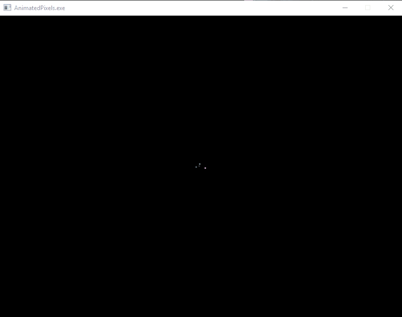

Lo and behold, you now have your first animation! It's nothing fancy, it's a bunch of dots moving around.

But it's the start of graphics programming. Think of it like this, you are now at the Atari 2600 level of graphics programming. Go us!

## Moving forward - loading and displaying bitmaps

What do I mean when I use the term 'Bitmap'? Typically, I'm refering to an image of some sort, stored in a file like PNG, BMP, or one of the many formats. I'm not going to go into a lot of detail about bitmap formats, compression algorithms and the like. However, the goal in our next bit is to be able to load any bitmap generated and exported from traditional Digital Content Creation (DCC) packages like photoshop, Krita, Paint.net ... whatever.

But what is a Bitmap? Wikipedia defines it as:

> a mapping from some domain (for example, a range of integers) to bits (values which are zeros and ones). It is also called a bit array or bitmap index. In computer graphics, when the domain is a rectangle (indexed by two coordinates) a bitmap gives a way to store a binary image, that is, an image in which each pixel is either black or white (or any two colors). _Source: [https://en.wikipedia.org/wiki/Bitmap](https://en.wikipedia.org/wiki/Bitmap)

We've seen in the above example that our domain _is_ a rectangle, as illsutrated by the output positions of the pixels. And we are mapping colours into a range of bits (24 Bits Per Pixel).

Now, with that in mind, how do we go about loading a Bitmap into our codebase? I've provided another project that illustrates how to do that, as well as how to display an image into the window:

``` C++
// spacedinvaders.cpp : Defines the entry point for the console application.
//

#include "stdafx.h"

#include <stdio.h>
#include <allegro5/allegro.h>
#include <allegro5/allegro_image.h>
#include <allegro5/allegro_primitives.h>
#include <allegro5/allegro_font.h>

// Forward Declarations
void Setup();
void Teardown();

// Global definitions
ALLEGRO_DISPLAY* gDisplay = nullptr;
ALLEGRO_FONT* gFont = nullptr;
ALLEGRO_EVENT_QUEUE* gEventQueue = nullptr;

// A new structure for holding a bitmap
ALLEGRO_BITMAP* gImage = nullptr;

int main()
{
  Setup();

  // We load the image, off disk, with this function
  gImage = al_load_bitmap("..\\resources\\imagesheet.png");

  while (true)
  {
    ALLEGRO_EVENT event;
    ALLEGRO_TIMEOUT timeout;
    al_init_timeout(&timeout, 0.06);

    bool get_event = al_wait_for_event_until(gEventQueue, &event, &timeout);

    if (get_event && event.type == ALLEGRO_EVENT_DISPLAY_CLOSE)
    {
      break;
    }

    al_clear_to_color(al_map_rgb(150, 150, 150));

    if (gImage != nullptr)
    {
      al_draw_bitmap(gImage, 0, 0, 0);
    }

    al_flip_display();
  }

  al_destroy_bitmap(gImage);
  Teardown();
  return 0;
}
```

Visual Studio Project: _bitmaps_

Also, for reference, here is our source image:

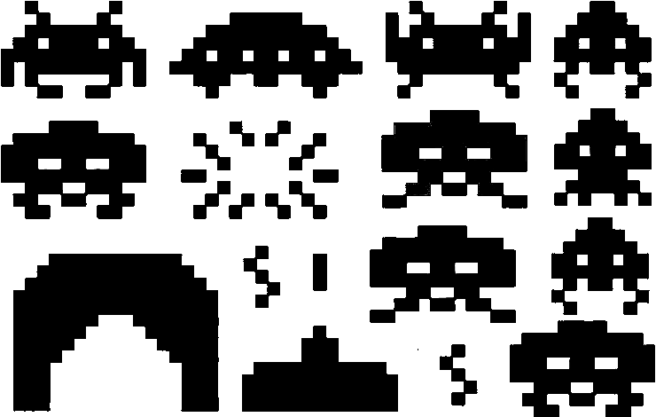

And the results of our program running:

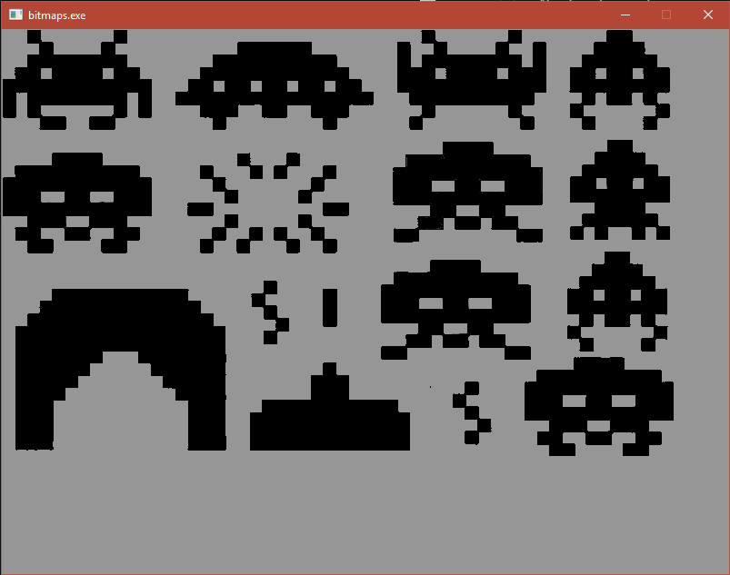

Here's something I'd like you to try. I have a function in this codebase called `Setup` - it's where I set up the application. There's a line in it that looks like this:

`gDisplay = al_create_display(800, 600);`

That sets the window size to 800x600 pixels big. Go ahead and change that to 1024x768 and re-run the program:

`gDisplay = al_create_display(1024, 768);`

This results in a different sized window:

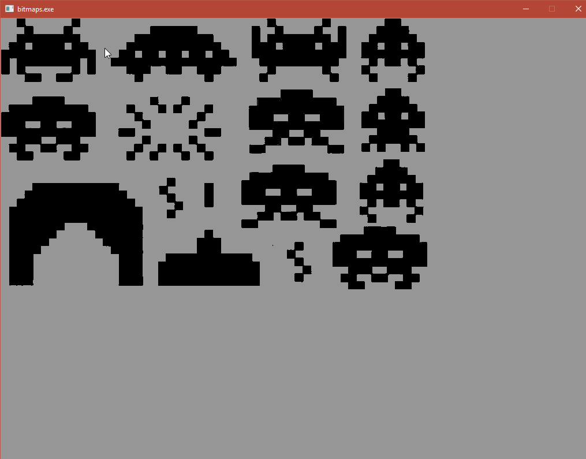

What we see here is the window is larger, but the bitmap is displayed in at the same size as before - it isn't stretched to fit. If it was rendered proportionately to the size of the window, we would say that the image had been _scaled_ to the size of the window.  Go ahead and reset your window size to 800x600 to continue.

How did we accomplish this? Let's review aspects of the code above.

``` C++
  // We load the image, off disk, with this function
  gImage = al_load_bitmap("..\\resources\\imagesheet.png");
```

The function `al_load_bitmap` is how we load an image from disk. Please note that this function wouldn't work if we didn't initialize the allegro image subsystem in the `Setup` function (via the call to `al_init_image_addon();`). Calling that function initializes the system for loading various bitmap formats (PNG, BMP, GIF, etc). If we are able to load the bitmap, `gImage` will be a non-null pointer value (it will have a value that is not equal to `nullptr`).

Once we have a bitmap, we can then 'blit' the image to the screen. This means that we copy the image data from one location, typicaly a rectangular area, to another destination. To be more precise, Wikipedia defines a Blit operation as a _Bit Blit_:

> Bit blit (also written BITBLT, BIT BLT, BitBLT, Bit BLT, Bit Blt etc., which stands for bit block transfer) is a data operation commonly used in computer graphics in which several bitmaps are combined into one using a boolean function.

> The operation involves at least two bitmaps, one source and destination, possibly a third that is often called the "mask" and sometimes a fourth used to create a stencil. The pixels of each are combined bitwise according to the specified raster operation (ROP) and the result is then written to the destination. The ROP is essentially a boolean formula. The most obvious ROP overwrites the destination with the source. Other ROPs may involve AND, OR, XOR, and NOT operations.[1] The Commodore Amiga's graphics chipset, for example, could combine three source bitmaps according to any of 256 boolean functions of three variables.

In our current example, we see that the entire source bitmap is copied to the output window. Please consider the output window another bitmap. Why? Because under the hood, it actually _is_ another bitmap! We'll talk about that more when we discuss a topic called 'double buffering'.

With that said, that's a lot of things to copy. If I wanted to copy the spaced invader in the top left of the image, would I have to export just that image from my image creation program, and load that into an allegro bitmap? I totally could. I could also create an array of bitmaps that are loaded from disk and use each element in the array to represent the image for a type of invader.  And I'll probably end up doing that in the long run.

However, what if I wanted to keep all the images in one 'imagesheet'? And I just watned to copy a rectangular area out of that source image and display it on the destination bitmap?

Allegro has a function for that, called `al_draw_scaled_bitmap`. And it looks like this:

``` C++
al_draw_scaled_bitmap(gImage, 0, 0, 170, 115, 200, 200, 170*.5, 115*.5, 0);
al_draw_scaled_bitmap(gImage, 430, 0, 170, 115, 300, 200, 170 * .5, 115 * .5, 0);
al_draw_scaled_bitmap(gImage, 430, 116, 170, 120, 400, 200, 170 * .5, 115 * .5, 0);
```

If you replace the original `al_draw_bitmap` call with the above, you'll get this:

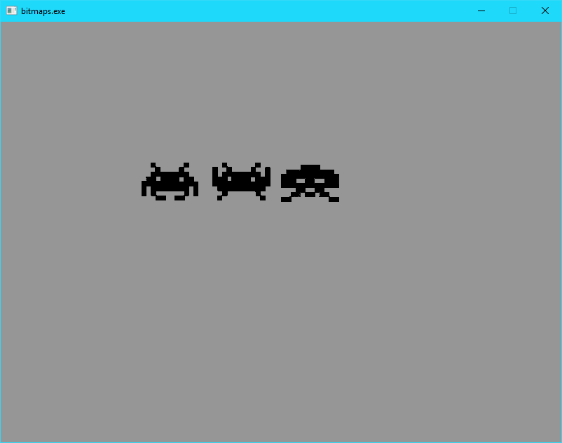

We now have a simple method for copying rectangle information out of one bitmap and into another. This is a very, very powerful tool in our programming arsenal.

### More on Image Formats

Take a second in the codebase we've been working with and change a value:

`al_clear_to_color(al_map_rgb(150, 150, 150));`

Change that line to:

`al_clear_to_color(al_map_rgb(200, 50, 50));`

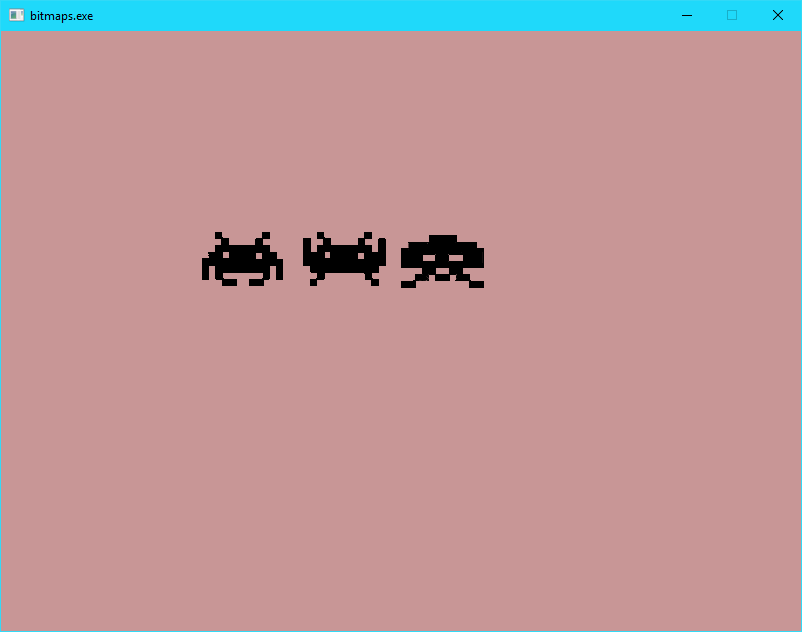

I'm hoping it's apparent that changing the background colour of the window does something interesting. If you look at the source image, the background colour of the area around the black spaced invaders isn't that colour - it looks white.

But it's not. When I saved the .png file, I actually used a 'transparent' background colour as the background. This has the effect of masking the area around the invaders. This allows those invader characters to be displayed over the top of a background without any additional cruft.

For example, if I was to change the source `imagesheet.png` with an image that _didn't_ have a transparent background colour:

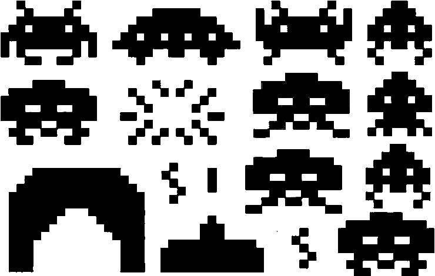

And changed the image that we loaded:

`gImage = al_load_bitmap("..\\resources\\badimagesheet.png");`

And then re-ran the program, we would end up with this:

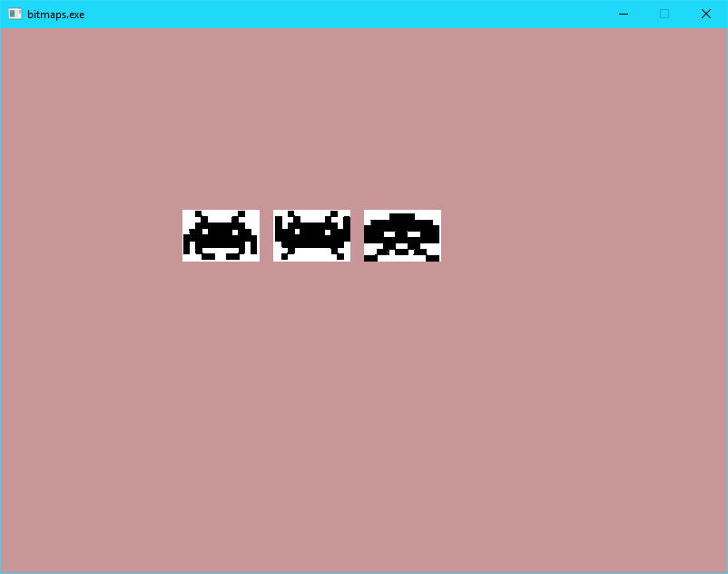

That's one of the reasons we like to use transparent images.

Please note that we can also stack images on top of each other. Let's do this by adding a background to our window and then draw the invaders over the top.

First off, let's add a new global variable, called `gBackground`

``` C++
// A new structure for holding a bitmap
ALLEGRO_BITMAP* gImage = nullptr;
ALLEGRO_BITMAP* gBackground = nullptr;
```

and then let's load up a new 800x600 image:

``` C++
// We load the image, off disk, with this function
gImage = al_load_bitmap("..\\resources\\imagesheet.png");
gBackground = al_load_bitmap("..\\resources\\background.png");
```

And then update our drawing bit of code:

``` C++
al_clear_to_color(al_map_rgb(200, 150, 150));

al_draw_bitmap(gBackground, 0, 0, 0);

if (gImage != nullptr)
{
  al_draw_scaled_bitmap(gImage, 0, 0, 170, 115, 200, 200, 170*.5, 115*.5, 0);
  al_draw_scaled_bitmap(gImage, 430, 0, 170, 115, 300, 200, 170 * .5, 115 * .5, 0);
  al_draw_scaled_bitmap(gImage, 430, 116, 170, 120, 400, 200, 170 * .5, 115 * .5, 0);
}

al_flip_display();
```

Our output now looks like this:

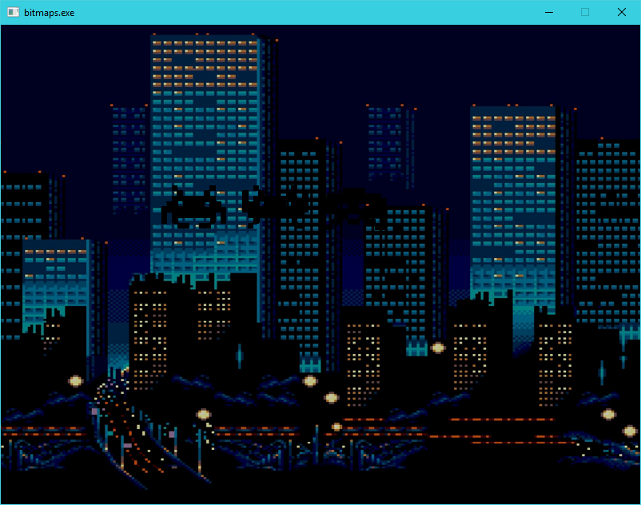

This may be a bit hard to see.

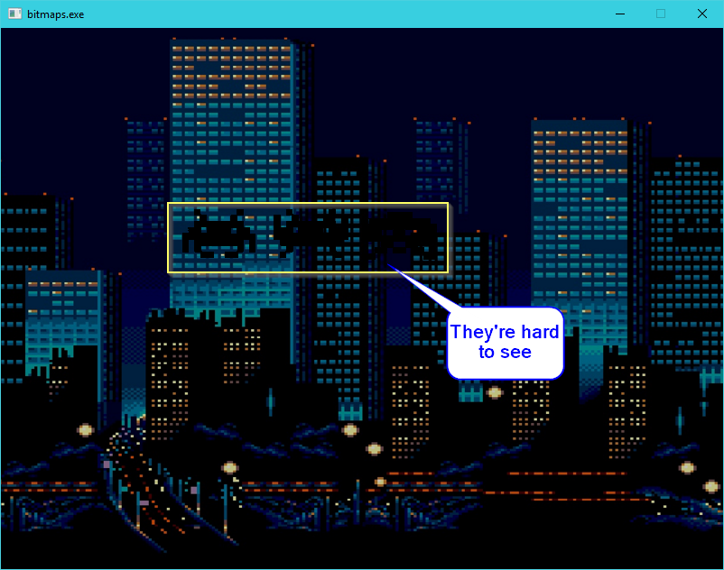

If I was to change the draw order, and do this:

``` C++
al_clear_to_color(al_map_rgb(200, 150, 150));

if (gImage != nullptr)
{
  al_draw_scaled_bitmap(gImage, 0, 0, 170, 115, 200, 200, 170*.5, 115*.5, 0);
  al_draw_scaled_bitmap(gImage, 430, 0, 170, 115, 300, 200, 170 * .5, 115 * .5, 0);
  al_draw_scaled_bitmap(gImage, 430, 116, 170, 120, 400, 200, 170 * .5, 115 * .5, 0);
}

al_draw_bitmap(gBackground, 0, 0, 0);

al_flip_display();
```

We would only see the background:

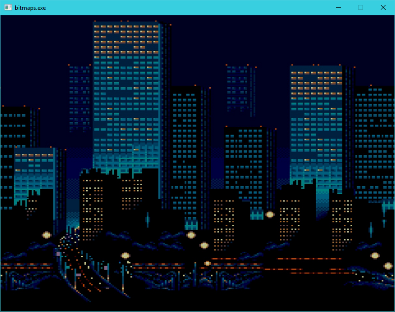

Because we are drawing the invaders first and then drawing the background over the top, completely obscuring them.

Think of it like placing a poker felt on a table and then placing the cards on top of the felt. Reverse that order and you won't see the cards, because they'll be under the felt.

## The Wrap up

That's a good place to call it for this article. We're not done with bitmaps, not by a long shot. We'll continue with them in the next article, where we'll mix bitmaps, animations and movements.

Until then!

-Ash