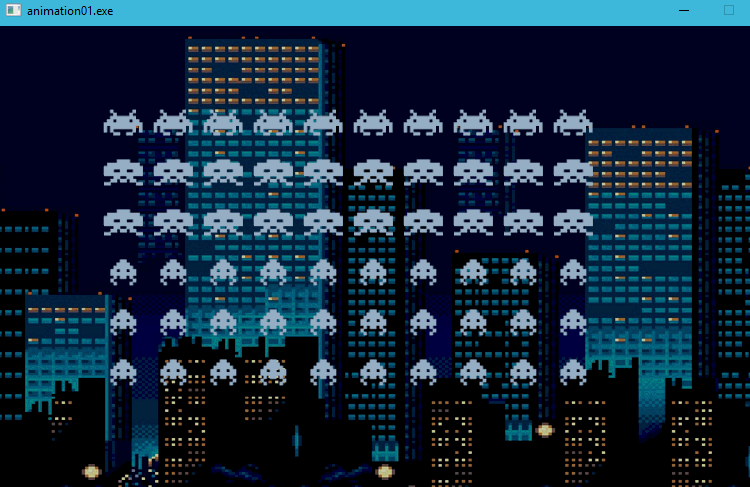
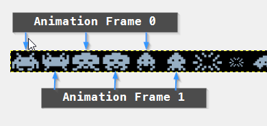
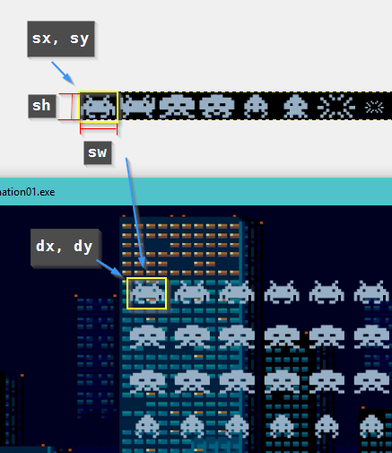
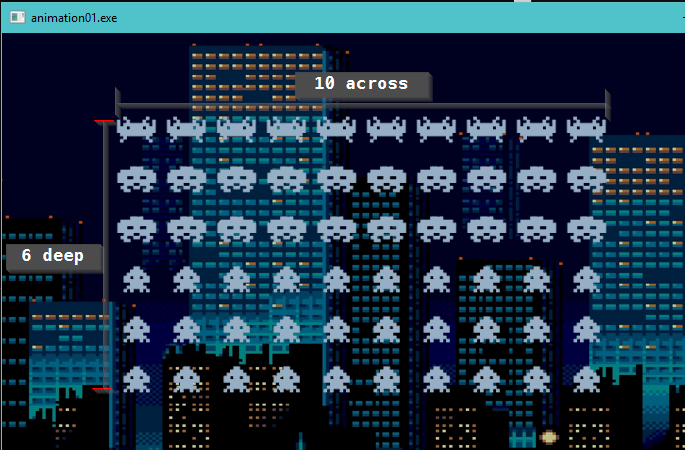

# Animation Part 2

## Summary

In the last article, I illustrated a very simple mechanism for animating sprites. In this article, I'm going to expand on that a little and try to develop a system that isn't quite so dependant of the `al_wait_for_event_until` function.

## What is FPS?

FPS (Frames Per Second) is a standard way of determining the 'quality' of animation; more animation frames per second == smoother animation. We've seen what that looks like in our last example, by simply 'pausing' our application for a specific set of time. But that's not really a great way to do it. Why?

Here's the thing, each iteration through the main loop of our program might not take the exact same amount of time, depending on the workload we have running under the hood. So that pause we have via the `al_wait_for_event_until` is a fixed amount of time, but everything else can vary.

So, on one loop, we may take .01 seconds to process, but on the next, it may take .2 seconds. The original pause via the `al_wait_for_event_until` was set to 0.06 seconds, so we now have loops taking 0.07 and 0.09 seconds. Thus the animation may 'judder' over time; we end up holding a frame of animation too long.

To correct this, we need to determine the time between frames; and only advance our movement / animations based on the time that has elapsed between frames.

So, we're not actually interested in maintaining FPS, but we want to track the time between frames.

With that in mind, here's what we're trying to accomplish:



## Let's look at the code

Again, this is an abbreviated source code listing. The actual code can be found in the `animation01` project.

``` C++
const int kCellX = 44;
const int kCellY = 32;

const double kImmediate = 0.0;

int main()
{
	Setup();

	LoadResources();

	if ((gImageSheet == nullptr) || (gBackground == nullptr))
	{
		printf("Failed to load image resources!\n");
	}

	int deltaX = 0;
	int incrementor = 1;
	int animFrame = 0;

	ALLEGRO_EVENT event;
	ALLEGRO_TIMEOUT timeout;

	double currentTime = al_get_time();
	double lastTime = currentTime;
	double lastMoveTime = currentTime;

	while (true)
	{
		al_init_timeout(&timeout, kImmediate);
		bool get_event = al_wait_for_event_until(gEventQueue, &event, &timeout);

		if (get_event && event.type == ALLEGRO_EVENT_DISPLAY_CLOSE)
		{
			break;
		}

		al_draw_bitmap(gBackground, 0, 0, 0);

		const int offset = 50;
		for (int index = 0; index < 10; index++)
		{
			al_draw_bitmap_region(gImageSheet, kCellX * animFrame, 0, kCellX, kCellY, deltaX + 100 + offset * index, 80, 0);
			al_draw_bitmap_region(gImageSheet, (kCellX * (2 + animFrame)), 0, kCellX, kCellY, deltaX + 100 + offset * index, 80 + 50, 0);
			al_draw_bitmap_region(gImageSheet, (kCellX * (2 + animFrame)), 0, kCellX, kCellY, deltaX + 100 + offset * index, 80 + (50 * 2), 0);
			al_draw_bitmap_region(gImageSheet, (kCellX * (4 + animFrame)), 0, kCellX, kCellY, deltaX + 100 + offset * index, 80 + (50 * 3), 0);
			al_draw_bitmap_region(gImageSheet, (kCellX * (4 + animFrame)), 0, kCellX, kCellY, deltaX + 100 + offset * index, 80 + (50 * 4), 0);
			al_draw_bitmap_region(gImageSheet, (kCellX * (4 + animFrame)), 0, kCellX, kCellY, deltaX + 100 + offset * index, 80 + (50 * 5), 0);
		}

		currentTime = al_get_time();

		// Move our characters
		if ((currentTime - lastMoveTime) > 0.1)
		{
			deltaX += incrementor;

			if (deltaX < -100)
			{
				incrementor = 1;
			}
			if (deltaX > 200)
			{
				incrementor = -1;
			}

			double over = currentTime - lastMoveTime - 0.1;
			lastMoveTime = currentTime - over;
		}

		// Animate our sprites
		if ((currentTime - lastTime) > 0.75)
		{
			animFrame = (int)!(bool)animFrame;
			double over = currentTime - lastTime - 0.75;
			lastTime = currentTime - over;
		}


		al_flip_display();
	}

	Teardown();

	return 0;
}
```

### Breaking the code down

First off, we have some constants:

``` C++
const int kCellX = 44;
const int kCellY = 32;

const double kImmediate = 0.0;
```

The first two constants are the width and height of the cells of the spritemap:


Each cell has a dimension of 44 x 32 pixels. We may as well make that a constant for our purposes.

The next constant is a number I'm using to represent an 'immediate' return value for the `al_init_timeout` - we want our polling call to come back as fast as possible.

Our main function has a few additions:

``` C++
int main()
{
	Setup();

	LoadResources();

	if ((gImageSheet == nullptr) || (gBackground == nullptr))
	{
		printf("Failed to load image resources!\n");
	}

	int deltaX = 0;
	int incrementor = 1;
	int animFrame = 0;

	ALLEGRO_EVENT event;
	ALLEGRO_TIMEOUT timeout;

	double currentTime = al_get_time();
	double lastTime = currentTime;
	double lastMoveTime = currentTime;

```

We keep track of a `deltaX` to see how far we've moved our invaders, an `incrementor` to use to determine which direction we're moving our invaders (+1 to move them right, -1 to move them left) and an `animFrame` to determine what frame of animation to use. 0 means the first frame of animation, 1 means the second frame.



Simply put, we want to drive our animation frame based on the value stored in `animFrame`.

We also need to initialize some time values ...

### How do we deal with timing

Allegro has a nifty little function called `al_get_time()`. It gives us the number of seconds (with a resolution of microseconds). So for our purposes, it's granular enough, even if it was just in the millisecond range. This returns us the number of seconds elapsed since allegro was initialized, as a double.

How do we 'throttle' our animations then?  Let's do some math:

This is Space Invaders. So eventually we're going to want to have the invaders move pretty fast. But the start out pretty slow. Let's assume that they move a pixel every tenth of a second. So we want to move then when the delta time (time since the last move) is greater than .1 of a second.

In the above code, we see that we store the current time (`currentTime`) as well as initializing `lastTime` and `lastMoveTime` to the same value. This allows us to now track delta times each time we iterate over our main loop.

``` C++
while (true)
{
    // This stuff we've seen before, so we can skip it in our review
    // ======================================================================
	al_init_timeout(&timeout, kImmediate);
	bool get_event = al_wait_for_event_until(gEventQueue, &event, &timeout);

	if (get_event && event.type == ALLEGRO_EVENT_DISPLAY_CLOSE)
	{
		break;
	}

	al_draw_bitmap(gBackground, 0, 0, 0);
    // ======================================================================

	const int borderOffset = 50;
	for (int index = 0; index < 10; index++)
	{
		al_draw_bitmap_region(gImageSheet, kCellX * animFrame, 0, kCellX, kCellY, deltaX + 100 + borderOffset * index, 80, 0);
		al_draw_bitmap_region(gImageSheet, (kCellX * (2 + animFrame)), 0, kCellX, kCellY, deltaX + 100 + borderOffset * index, 80 + 50, 0);
		al_draw_bitmap_region(gImageSheet, (kCellX * (2 + animFrame)), 0, kCellX, kCellY, deltaX + 100 + borderOffset * index, 80 + (50 * 2), 0);
		al_draw_bitmap_region(gImageSheet, (kCellX * (4 + animFrame)), 0, kCellX, kCellY, deltaX + 100 + borderOffset * index, 80 + (50 * 3), 0);
		al_draw_bitmap_region(gImageSheet, (kCellX * (4 + animFrame)), 0, kCellX, kCellY, deltaX + 100 + borderOffset * index, 80 + (50 * 4), 0);
		al_draw_bitmap_region(gImageSheet, (kCellX * (4 + animFrame)), 0, kCellX, kCellY, deltaX + 100 + borderOffset * index, 80 + (50 * 5), 0);
	}

	currentTime = al_get_time();

	// Move our characters
	if ((currentTime - lastMoveTime) > 0.1)
	{
		deltaX += incrementor;

		if (deltaX < -100)
		{
			incrementor = 1;
		}
		if (deltaX > 200)
		{
			incrementor = -1;
		}

		double over = currentTime - lastMoveTime - 0.1;
		lastMoveTime = currentTime - over;
	}

	// Animate our sprites
	if ((currentTime - lastTime) > 0.75)
	{
		animFrame = (int)!(bool)animFrame;
		double over = currentTime - lastTime - 0.75;
		lastTime = currentTime - over;
	}


	al_flip_display();
}
```

That's a bit of code, so let's break it down:

``` C++
const int borderOffset = 50;
for (int index = 0; index < 10; index++)
{
	al_draw_bitmap_region(gImageSheet, kCellX * animFrame, 0, kCellX, kCellY, deltaX + 100 + borderOffset * index, 80, 0);
	al_draw_bitmap_region(gImageSheet, (kCellX * (2 + animFrame)), 0, kCellX, kCellY, deltaX + 100 + borderOffset * index, 80 + 50, 0);
	al_draw_bitmap_region(gImageSheet, (kCellX * (2 + animFrame)), 0, kCellX, kCellY, deltaX + 100 + borderOffset * index, 80 + (50 * 2), 0);
	al_draw_bitmap_region(gImageSheet, (kCellX * (4 + animFrame)), 0, kCellX, kCellY, deltaX + 100 + borderOffset * index, 80 + (50 * 3), 0);
	al_draw_bitmap_region(gImageSheet, (kCellX * (4 + animFrame)), 0, kCellX, kCellY, deltaX + 100 + borderOffset * index, 80 + (50 * 4), 0);
	al_draw_bitmap_region(gImageSheet, (kCellX * (4 + animFrame)), 0, kCellX, kCellY, deltaX + 100 + borderOffset * index, 80 + (50 * 5), 0);
}
```

This is where we draw the invaders. If you remember the call to `al_draw_bitmap_region`, it breaks down like this:

``` C++
void al_draw_bitmap_region(
    ALLEGRO_BITMAP *bitmap, // The source bitmap to draw from
    float sx,               // The starting X position of the source rectangle
    float sy,               // The starting Y position of the source rectangle
    float sw,               // The width of the rectangle to copy
    float sh,               // The height of the rectangle to copy
    float dx,               // The destination X position to draw the source rectangle
    float dy,               // The destination Y position to draw the source rectangle
    int flags)              // Don't worry about this for now, assume 0 is the right value
```

That breaks down like this:



And in the `for` loop above, we're actually drawing off each column of the invaders (10 columns of invaders are rendered, 6 deep)



In the above code, we just updated the `deltaX` to move the sprites across the screen, and use `animFrame` as the X offset into our sprite map. Remember, we've used a regular grid to store these sprites, and it makes the math simple to 'look them up' on the sprite sheet.

### Time based animation

Let's first look at how we determine what `deltaX` is going to be:

``` C++
currentTime = al_get_time();

// Move our characters
if ((currentTime - lastMoveTime) > 0.1)
{
	deltaX += incrementor;

	if (deltaX < -100)
	{
		incrementor = 1;
	}
	if (deltaX > 200)
	{
		incrementor = -1;
	}

	double over = currentTime - lastMoveTime - 0.1;
	lastMoveTime = currentTime - over;
}
```

That first test shouldn't need too much explaining - if the time delta between the current time and the last time we moved our sprites is greater than 0.1 (that's one tenth of a second), then we need to do work. Otherwise carry on.

The work is also pretty straightforward: increment the `deltaX` by either a +1 or -1. If we are at the left edge of the screen, go right. If we are at the right edge of the screen, go left.

Either way, since we're moving, we now need to update the `lastMoveTime`. This is a little more complex. We _could_ have just set the `lastMoveTime` to `currentTime`. And that would sort of work. But the problem is, we aren't _ever_ (except for some very rare edge cases) going to have the difference between `lastMoveTime` and `currentTime` be zero. So if we were to set `lastMoveTime` to `currentTime` we would lose that remainder. Doing that will cause some degree of loss and will eventually add up to us lagging behind (movement between one pixel to the next may take longer than expected). That's where the `over` variable comes into play. `currentTime - lastMoveTime` is always going to be greater than (or equal to) 0.1 - the `if` condition ensures that. We could have called `over` the time 'over' our criteria. This means that we won't ever lose any real accuracy.

If you want, feel free to change

``` C++
double over = currentTime - lastMoveTime - 0.1;
lastMoveTime = currentTime - over;
```

to

``` C++
lastMoveTime = currentTime;
```

To see what I'm talking about. You may need to record the app to see the difference - it's subtle, but it is there.

Now, there's a lot that I'm assuming with this bit of math:

1. It will never take longer than .1999... seconds to process the main game loop. If it does, we're still going to lag in moving the invaders. However, for our intents this is an 'ok' assumption.
2. `al_get_time` is fairly accurate.

So that's movement. Now on to animating the sprites.

``` C++
// Animate our sprites
if ((currentTime - lastTime) > 0.75)
{
	animFrame = (int)!(bool)animFrame;
	double over = currentTime - lastTime - 0.75;
	lastTime = currentTime - over;
}
```

That's pretty much the same logic as before, except that we are now using 3/4ths of a second to animate our sprites.

## Wrap up

We now have looked into a more 'proper' sprite based animation system. This is by no means the 'right' way to do it, but it helps illustrate the point about animation; timing is everything!

In our next article, we're going to look into cleaning this up a little more, by using structs to better represent our invaders.

Until next time!

Ash