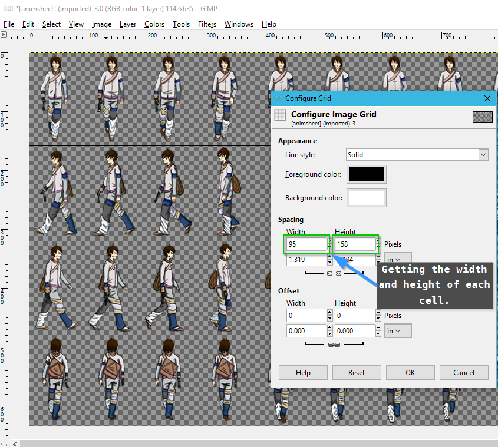
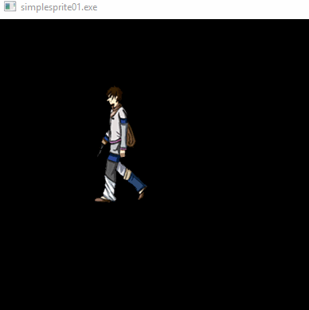
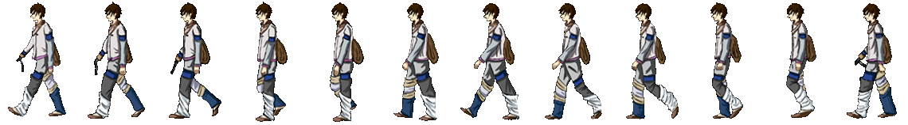
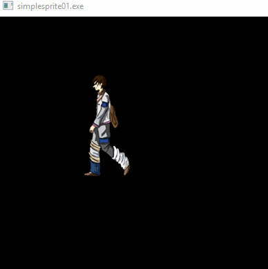
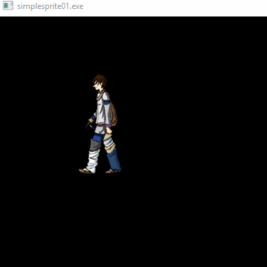
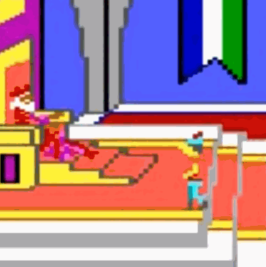

# Simple Animation

In this article, we're going to be a little light on 'new' programming topics. Consider this a review of sorts.

However, we are going to talk about a few new concepts. Nothing crazy difficult, but stuff that will help us out in our goal to build a game (of sorts).

## Sprites and Sprite Based Animation

We've seen that we can put an image on the screen. We've also seen that we can put a smaller sub-section of the image on the screen. We can call that a sprite. A sprite is a 2D graphic that can be moved around on the screen. An Animated sprite, is the same thing, but it also has an illusion of inherent motion.

Remember the example from an older article:


That running horse could also be considered an animated sprite.

Let's actually animate something in an application.  Here's a sample walk animation that we're going to utilize (source for this is in the Reference section):


Let's take the second row of that animation sheet and animate that. It's easier to see the animation cycle in that row, rather than the first. So let's look into that.



Each one of those cells represents an animtion frame. If we display each one of those cells, in sequence, we get the illusion of animation.

## Let's render the sprite



Let's look at the code that would do that. This is from the `simplesprite01` project.

The main function looks like:

``` C++
int main()
{
	Setup();

	ALLEGRO_BITMAP*	mSpriteSheet = al_load_bitmap("..\\resources\\animsheet.png");
	int animFrame = 0;

	while (true)
	{
		ALLEGRO_EVENT event;
		ALLEGRO_TIMEOUT timeout;
		al_init_timeout(&timeout, 0.1);

		bool get_event = al_wait_for_event_until(gEventQueue, &event, &timeout);

		if (get_event && event.type == ALLEGRO_EVENT_DISPLAY_CLOSE)
		{
			break;
		}

		al_clear_to_color(al_map_rgb(0, 0, 0));

		al_draw_bitmap_region(mSpriteSheet, 95 * animFrame, 0, 95, 158, 100, 80, 0);

		animFrame = animFrame++;
		animFrame = animFrame % 12;

		al_flip_display();
	}

	Teardown();

	return 0;
}
```

### Breaking down the code
Taking a look at our animsheet, I've extracted out the row we're most interested in, for simplicity sake:



I broke this out into it's own file for simplicity. However, there's no reason why I couldn't have continued to use the source image sheet, as a grid.

I also moved the sprites around a litte, to better align them - there was some drift in the source material. To edit them, I used this nifty little online editor called [Piskel](https://www.piskelapp.com). 

Anyway, back to the code:

``` C++
ALLEGRO_BITMAP*	mSpriteSheet = al_load_bitmap("..\\resources\\animsheet.png");
int animFrame = 0;
```

Just loading up the bitmap for us to use.

``` C++
while (true)
{
	ALLEGRO_EVENT event;
	ALLEGRO_TIMEOUT timeout;
	al_init_timeout(&timeout, 0.1);

	bool get_event = al_wait_for_event_until(gEventQueue, &event, &timeout);

	if (get_event && event.type == ALLEGRO_EVENT_DISPLAY_CLOSE)
	{
		break;
	}
```

This is where we break out of the infinite loop if we close the window (or press Alt-F4). But there's a difference this time.

In `al_init_timeout(&timeout, 0.1);` notice that normally we use `0.06` - but now we use '0.1`. Why's that?

Well, go ahead and give it a try - change it back to `0.06`, or any other value.

  

(That's values of 0.06, 0.5, 0.25, for reference)

So ... that controls the rate of animation? The larger the value the slower the animation?

Kind of, but it's only an accidental effect of changing that value. You see, `al_wait_for_event` does just exactly that - it waits for a specified event, or a timeout - a period of time to elapse, before moving on to the next line of code. And thus no other operation can occur. These operations are called 'Syncronous' opertaions. So, since we pause operations for a period of time, we hold the frame on screen for a longer period of time. Yes, this looks like the animation is moving slower, but it also is far less smooth; the animation is incredibly jerky.

Our goal, is to get as many 'frames' of animation on the screen as possible - it's one of the reasons why gamers like higher frame rates; we end up with smoother animations.

Here's a comparison:

#### Original Kings Quest



#### Newest Kings Quest


Now, there's a lot more going on there than the 'pause' between displaying images, but I think you can see that the walk cycle in the original game was around 5-10 frames and the more recent title ... has a lot more ;)

## A couple of points to make

The method I've shown here is the absolute _worst_ way to do framerate limitation. Any professional coder that looks at this will undoubtably roll their eyes and sigh in consternation. In the next article, we'll actually do it _properly_. However, this is a good explaination of how sprite based animation works.

## Reference Material

- [Sample Walk Animtaion](https://mattrobenolt.com/jquery-sprite-plugin/)
- [Piskel Animated Sprite Editor](https://www.piskelapp.com)
