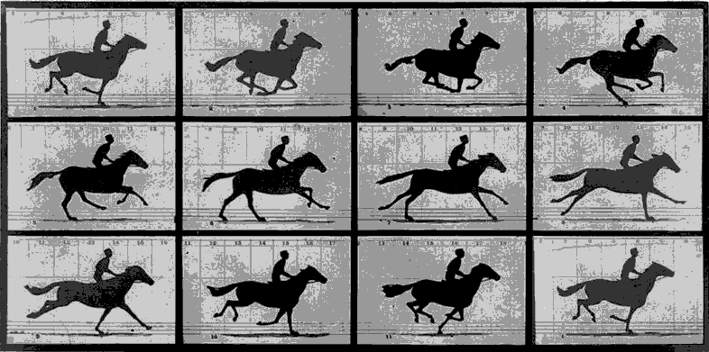

# Simple Animation

In this article, we're going to be a little light on 'new' programming topics. Consider this a review of sorts.

However, we are going to talk about a few new concepts. Nothing crazy difficult, but stuff that will help us out in our goal to build a game (of sorts).

## Sprites and Sprite Based Animation

We've seen that we can put an image on the screen. We've also seen that we can put a smaller sub-section of the image on the screen. We can call that a sprite. A sprite is a 2D graphic that can be moved around on the screen. An Animated sprite, is the same thing, but it also has an illusion of inherent motion.

Remember the example from an older article:

That running horse could also be considered an animated sprite.

Let's actually animate something in an application.  Here's a sample walk animation that we're going to utilize (source for this is in the Reference section):

Let's take the second row of that animation sheet and animate that. It's easier to see the animation cycle in that row, rather than the first. So let's look into that.

| Width | Height |
|:-----:|:------:|
| 95 | 158 |

Each one of those cells represents an animtion frame. If we display each one of those cells, in sequence, we get the illusion of animation.

Let's look at the code that would do that.

## Reference Material

- [Sample Walk Animtaion](https://mattrobenolt.com/jquery-sprite-plugin/)
