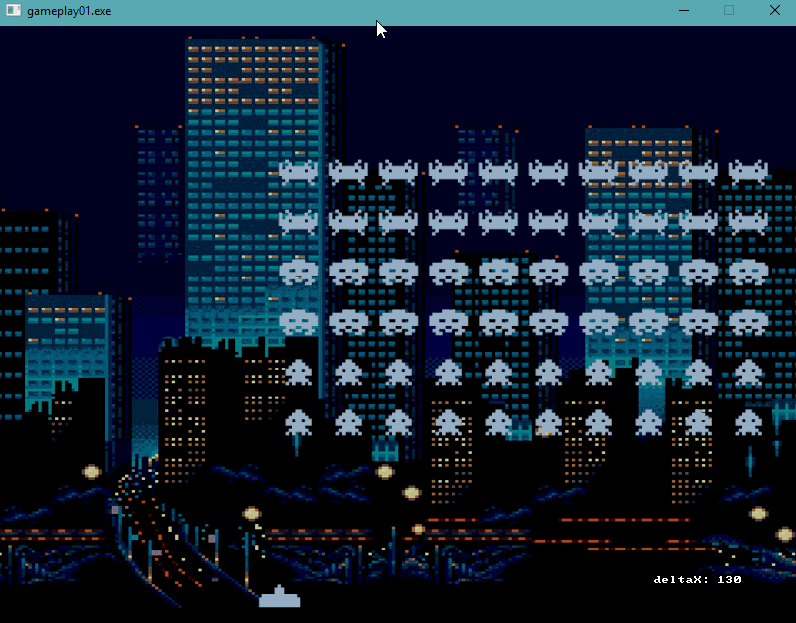

# Gameplay - or how to make our game a 'Game'

## Summary

This article is going to be the most 'complete' articles I've done; it's going to be a long article. However, by the end of this article we're going to have a minimal 'game', like so:



## What we're going to cover

We need to be able to display and move our `gunship`. We're going to need to be able to create a 'shot' and we're also going to need to be able to blow up our invaders when the shot hits them. Sounds pretty trivial, but it's actually a fair bit of code. Let's dig in

## Redefining what it means to be something in the gameplay

We've got a lot of 'things' to represent in our game; the invaders, the gunship, bullets. And there are some commonalities among all of those types of game objects:

- Position in space
- A way to look-up the image in the Sprite Sheet
- If the object has been shot.

That data seems like a candidate for a structure. What do we need to have this encompass? A position in space would be a point in space. Let's map that point to a Cartesian 2D point.

``` C++
struct Point
{
    float X;
    float Y;
};
```

So, now that we have a `Point`, let's have a way to look up an image in the sprite sheet:

``` C++
struct Box
{
    Point Start;
    float Width;
    float Height;
};
```

I'm explicitly storing the `Width` and `Height` here for illustration purposes - normally I'd just store that as another Point. Or, explicitly store the data as four floats.

Now that we have some additional structures, what does it look like as a `GameObject`?

``` C++
struct GameObject
{
    bool Visible;
    Point WorldPosition;
    Box Sprite;
};
```

What we have now is a new type that we can use to represent pretty much every object in our game. Let's create a few globals to hold some of our game objects:

``` C++
// Constants
const int     kMaxInvaders = 60;
const float   kCellX = 44.0f;
const float   kCellY = 32.0f;
const double  kImmediate = 0.0;
const float   kLateralMovement = 150.0f;
const float   kPlayerShotSpeed = 450.0f;

// Global definitions
// snip
// ... Stuff we don't need to cover again
// snip
GameObject  gInvaders[kMaxInvaders];

GameObject  gGun;
GameObject  gShot;
```

Now we have an array of invaders, a 'gun' - this is our Gunship and the shot from the gunship. We're only allowing one shot of a time, as this is in line with the original game.

Now that we have this, how do we initialize the data? I've created a new function called `InitializeLevel`.

``` C++
void InitializeLevel()
{
    // set up our references for each row
    int borderOffset = 50;
    int offsetX = 50;

    // we iterate over all the columns, initializing each invader along the line.
    for (int index = 0; index < 10; index++)
    {
        gInvaders[index].Visible = true;
        gInvaders[index].Sprite.Start.X = 0;
        gInvaders[index].Sprite.Start.Y = 0;
        gInvaders[index].Sprite.Width  = kCellX;
        gInvaders[index].Sprite.Height = kCellY;
        gInvaders[index].WorldPosition.X = offsetX + 100 + borderOffset * index;
        gInvaders[index].WorldPosition.Y = 80 + 50;

        gInvaders[index + 10].Visible = true;
        gInvaders[index + 10].Sprite.Start.X = 0;
        gInvaders[index + 10].Sprite.Start.Y = 0;
        gInvaders[index + 10].Sprite.Width = kCellX;
        gInvaders[index + 10].Sprite.Height = kCellY;
        gInvaders[index + 10].WorldPosition.X = offsetX + 100 + borderOffset * index;
        gInvaders[index + 10].WorldPosition.Y = 80 + (50 * 2);

        gInvaders[index + 20].Visible = true;
        gInvaders[index + 20].Sprite.Start.X = kCellX * 2;
        gInvaders[index + 20].Sprite.Start.Y = 0;
        gInvaders[index + 20].Sprite.Width = kCellX;
        gInvaders[index + 20].Sprite.Height = kCellY;
        gInvaders[index + 20].WorldPosition.X = offsetX + 100 + borderOffset * index;
        gInvaders[index + 20].WorldPosition.Y = 80 + (50 * 3);

        gInvaders[index + 30].Visible = true;
        gInvaders[index + 30].Sprite.Start.X = kCellX * 2;
        gInvaders[index + 30].Sprite.Start.Y = 0;
        gInvaders[index + 30].Sprite.Width = kCellX;
        gInvaders[index + 30].Sprite.Height = kCellY;
        gInvaders[index + 30].WorldPosition.X = offsetX + 100 + borderOffset * index;
        gInvaders[index + 30].WorldPosition.Y = 80 + (50 * 4);

        gInvaders[index + 40].Visible = true;
        gInvaders[index + 40].Sprite.Start.X = kCellX * 4;
        gInvaders[index + 40].Sprite.Start.Y = 0;
        gInvaders[index + 40].Sprite.Width = kCellX;
        gInvaders[index + 40].Sprite.Height = kCellY;
        gInvaders[index + 40].WorldPosition.X = offsetX + 100 + borderOffset * index;
        gInvaders[index + 40].WorldPosition.Y = 80 + (50 * 5);

        gInvaders[index + 50].Visible = true;
        gInvaders[index + 50].Sprite.Start.X = kCellX * 4;
        gInvaders[index + 50].Sprite.Start.Y = 0;
        gInvaders[index + 50].Sprite.Width = kCellX;
        gInvaders[index + 50].Sprite.Height = kCellY;
        gInvaders[index + 50].WorldPosition.X = offsetX + 100 + borderOffset * index;
        gInvaders[index + 50].WorldPosition.Y = 80 + (50 * 6);
    }

    // Now we initialize our Gun
    gGun.Sprite.Start.X = 444;
    gGun.Sprite.Start.Y = 0;
    gGun.Sprite.Width = kCellX;
    gGun.Sprite.Height = kCellY;
    gGun.WorldPosition.X = 10;
    gGun.WorldPosition.Y = 550;

    // And now we initialize the shot
    // Shot has a different width and height than everyone else
    gShot.Sprite.Start.X = 639;
    gShot.Sprite.Start.Y = 9;
    gShot.Sprite.Width = 4;
    gShot.Sprite.Height = 11;
    gShot.WorldPosition.X = 0;
    gShot.WorldPosition.Y = 0;
}
```

I've commented in-line. I've also been overly verbose in how I've set up each invader, more for the sake of education. However, there's nothing overly special going on here.

Now that we have our game objects set up, let's now look at moving our gun.

## Input handling

First off, we need to initialize input handling. We do that right after we do our input handling:

``` C++
int main()
{
    Setup();

    al_install_keyboard();
    al_register_event_source(gEventQueue, al_get_keyboard_event_source());
```

Now our program will add a keyboard event when we call `al_wait_for_event_until` into the `gEventQueue` as part of the `type` in the event as well as the `keyboard.keycode` value.

I've created a new function called `ProcessInput` that does just exactly what it advertises.  Here's what it looks like:

``` C++
void ProcessInput(ALLEGRO_EVENT ev)
{
    if (ev.type != ALLEGRO_EVENT_KEY_DOWN && ev.type != ALLEGRO_EVENT_KEY_UP) return;

    if (ev.type == ALLEGRO_EVENT_KEY_DOWN)
    {
        switch (ev.keyboard.keycode)
        {
            case ALLEGRO_KEY_LEFT:
                gMovementKey[Left] = true;
                break;
            case ALLEGRO_KEY_RIGHT:
                gMovementKey[Right] = true;
                break;
            case ALLEGRO_KEY_SPACE:
                gMovementKey[Spacebar] = true;
                break;
            default:
                break;
        }
    }
    else if (ev.type == ALLEGRO_EVENT_KEY_UP)
    {
        switch (ev.keyboard.keycode)
        {
            case ALLEGRO_KEY_LEFT:
                gMovementKey[Left] = false;
                break;
            case ALLEGRO_KEY_RIGHT:
                gMovementKey[Right] = false;
                break;
            case ALLEGRO_KEY_SPACE:
                gMovementKey[Spacebar] = false;
                break;
            default:
                break;
        }
    }
}
```

What we've got going on here is tracking if a given key is up or down. We're storing that information in an array. And we also have an enumeration that maps to those specific keys/events.

Here's the enum and the array:

``` C++
// Enumerations
enum InputKeys
{
    Left = 0,
    Right = 1,
    Spacebar = 2,
    Size = 3
};

bool gMovementKey[3];
```

There's a little more than we're used to seeing on the enum - the numerical value is ... exactly that. Enums break down to a numerical value, under the hood. What we're doing here is being explicit in what those numbers mean. This we can now bind to an element in the `gMovement` array.

This we now use to map to specific actions - essentially an action map. When one of the action map items are true, we want to perform that action. That's pretty straightforward.

Now that we have this, the action state, we can now use it to drive our game.

``` C++
void UpdateLogic(double deltaTime)
{
    if (gMovementKey[Spacebar] && !gShot.Visible)
    {
        gShot.WorldPosition.X = gGun.WorldPosition.X + gGun.Sprite.Width/2.0f - 3.0f;
        gShot.WorldPosition.Y = gGun.WorldPosition.Y;
        gShot.Visible = true;
    }

    if (gShot.Visible)
    {
        gShot.WorldPosition.Y = gShot.WorldPosition.Y - (kPlayerShotSpeed * deltaTime);

        if (gShot.WorldPosition.Y < 0)
        {
            gShot.Visible = false;
        }
    }

    if (gMovementKey[Left])
    {
        gGun.WorldPosition.X = gGun.WorldPosition.X - (kLateralMovement * deltaTime);
    }

    if (gMovementKey[Right])
    {
        gGun.WorldPosition.X = gGun.WorldPosition.X + (kLateralMovement * deltaTime);
    }

    gGun.WorldPosition.X = gGun.WorldPosition.X > (790.0f-kCellX) ? (790.0f - kCellX) : gGun.WorldPosition.X;
    gGun.WorldPosition.X = gGun.WorldPosition.X < 10.0f ? 10.0f : gGun.WorldPosition.X;

    // Now check for collision of the player's shot
    if (gShot.Visible)
    {
        for (size_t index = 0; index < kMaxInvaders; index++)
        {
            if (gInvaders[index].Visible && ShotCollide(gInvaders[index]))
            {
                gInvaders[index].Visible = false;
                gShot.Visible = false;
                break;
            }
        }
    }
}
```

We pass in a `float` to this function. This represents the delta time between frames. All of the numbers that we have in this function represent 'pixels per second'. We're also using fractional bits and rounding down (by default) when we render items to the screen. This is one of the other ways that we can get smooth animation based on the time between frames, like I was mentioning in the last article.

And then we have code that looks for collisions. It's pretty straightforward there as well - if an invader is visible, and the shot collides with an invader, we kill it. Killing it essentially is setting the invader invisible. And we reset the shot.

The more complex function here is determining if there is a collision between the invader and the shot. That's what the `ShotCollide` call does. That's going to take a little more explaining that I want to go into in this article. It's based on this:

- [Collision Detection](https://www.youtube.com/watch?v=8b_reDI7iPM)
- [2D AABB](https://www.youtube.com/watch?v=ENuk9HgeTiI)

Updating the position of the Invaders is pretty straightforward:

``` C++
void UpdateInvaders(int deltaX)
{
    for (int index = 0; index < 10; index++)
    {
        gInvaders[index].WorldPosition.X += deltaX;
        gInvaders[index + 10].WorldPosition.X += deltaX;
        gInvaders[index + 20].WorldPosition.X += deltaX;
        gInvaders[index + 30].WorldPosition.X += deltaX;
        gInvaders[index + 40].WorldPosition.X += deltaX;
        gInvaders[index + 50].WorldPosition.X += deltaX;
    }
}
```

The last bit is actually rendering off the game objects. That's pretty straightforward, to be honest:

``` C++
void Render(int animFrame)
{
    // Draw our invaders
    for (int index = 0; index < 10; index++)
    {
        if (gInvaders[index].Visible)
        {
            al_draw_bitmap_region(gImageSheet,
                gInvaders[index].Sprite.Start.X + animFrame * gInvaders[index].Sprite.Width,
                gInvaders[index].Sprite.Start.Y,
                gInvaders[index].Sprite.Width,
                gInvaders[index].Sprite.Height,
                gInvaders[index].WorldPosition.X,
                gInvaders[index].WorldPosition.Y,
                0);
        }

        if (gInvaders[index + 10].Visible)
        {
            al_draw_bitmap_region(gImageSheet,
                gInvaders[index + 10].Sprite.Start.X + animFrame * gInvaders[index].Sprite.Width,
                gInvaders[index + 10].Sprite.Start.Y,
                gInvaders[index + 10].Sprite.Width,
                gInvaders[index + 10].Sprite.Height,
                gInvaders[index + 10].WorldPosition.X,
                gInvaders[index + 10].WorldPosition.Y,
                0);
        }

        if (gInvaders[index + 20].Visible)
        {
            al_draw_bitmap_region(gImageSheet,
                gInvaders[index + 20].Sprite.Start.X + animFrame * gInvaders[index].Sprite.Width,
                gInvaders[index + 20].Sprite.Start.Y,
                gInvaders[index + 20].Sprite.Width,
                gInvaders[index + 20].Sprite.Height,
                gInvaders[index + 20].WorldPosition.X,
                gInvaders[index + 20].WorldPosition.Y,
                0);
        }

        if (gInvaders[index + 30].Visible)
        {
            al_draw_bitmap_region(gImageSheet,
                gInvaders[index + 30].Sprite.Start.X + animFrame * gInvaders[index].Sprite.Width,
                gInvaders[index + 30].Sprite.Start.Y,
                gInvaders[index + 30].Sprite.Width,
                gInvaders[index + 30].Sprite.Height,
                gInvaders[index + 30].WorldPosition.X,
                gInvaders[index + 30].WorldPosition.Y,
                0);
        }

        if (gInvaders[index + 40].Visible)
        {
            al_draw_bitmap_region(gImageSheet,
                gInvaders[index + 40].Sprite.Start.X + animFrame * gInvaders[index].Sprite.Width,
                gInvaders[index + 40].Sprite.Start.Y,
                gInvaders[index + 40].Sprite.Width,
                gInvaders[index + 40].Sprite.Height,
                gInvaders[index + 40].WorldPosition.X,
                gInvaders[index + 40].WorldPosition.Y,
                0);
        }

        if (gInvaders[index + 50].Visible)
        {
            al_draw_bitmap_region(gImageSheet,
                gInvaders[index + 50].Sprite.Start.X + animFrame * gInvaders[index].Sprite.Width,
                gInvaders[index + 50].Sprite.Start.Y,
                gInvaders[index + 50].Sprite.Width,
                gInvaders[index + 50].Sprite.Height,
                gInvaders[index + 50].WorldPosition.X,
                gInvaders[index + 50].WorldPosition.Y,
                0);
        }
    }

    if (gShot.Visible)
    {
        al_draw_bitmap_region(gImageSheet,
            gShot.Sprite.Start.X, gShot.Sprite.Start.Y,
            gShot.Sprite.Width, gShot.Sprite.Height,
            gShot.WorldPosition.X, gShot.WorldPosition.Y,
            0);
    }

    // Draw our gunship
    al_draw_bitmap_region(gImageSheet,
        gGun.Sprite.Start.X, gGun.Sprite.Start.Y,
        gGun.Sprite.Width, gGun.Sprite.Height,
        gGun.WorldPosition.X, gGun.WorldPosition.Y,
        0);
}
```

And again, nothing crazy here, just iterating over all the invaders and rendering those that are visible. and then we draw the gunship and the shot. That's just a lot of blitting of images. That's nothing crazy.

I'll leave it for an exercise for the reader to see how this is all stitched together in the `main` function.

## Wrap Up

So that's it. This is a sort-of working game. But there's lots we still need to do:

- Speed up as more invaders are destroyed.
- Destroyed animation when we blow up an invader
- reset the level once all invaders are destroyed
- when an edge column is destroyed, we need to allow the invaders to 'fill in' that area of movement.
- Have the invaders fire back and have some lives that get decremented.
- Game over and start screen.

And in the next article, let's look at a few more of those features.
